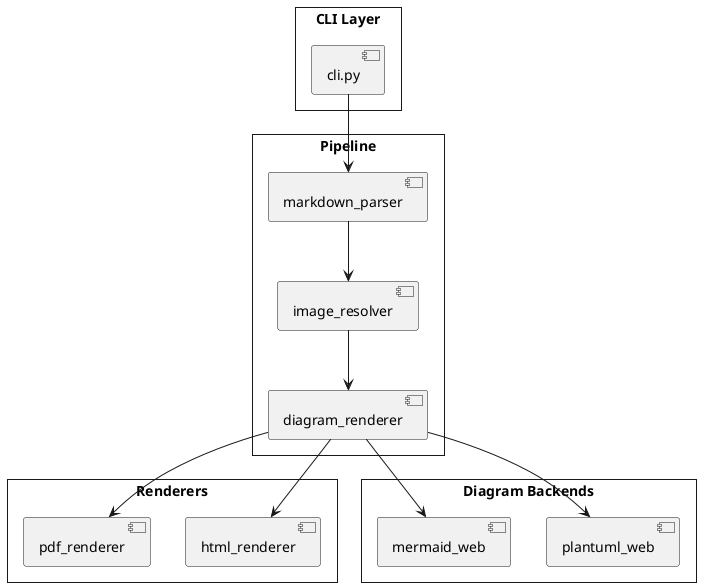
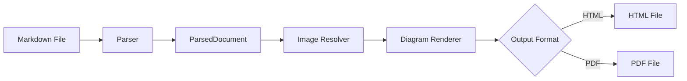
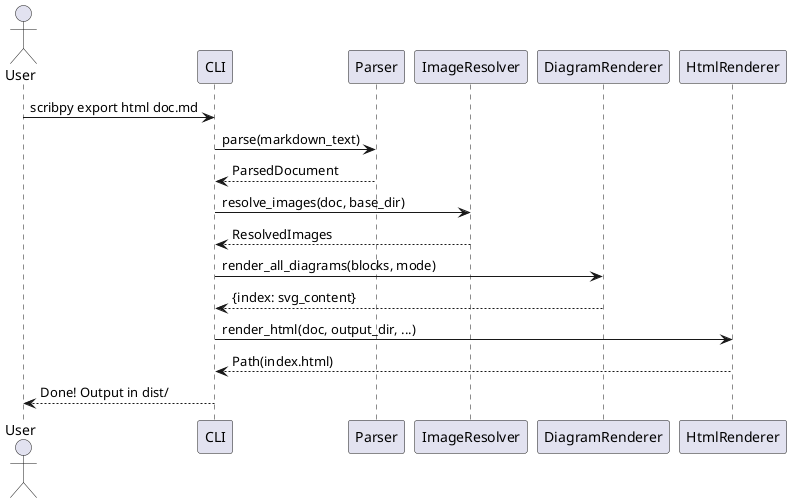
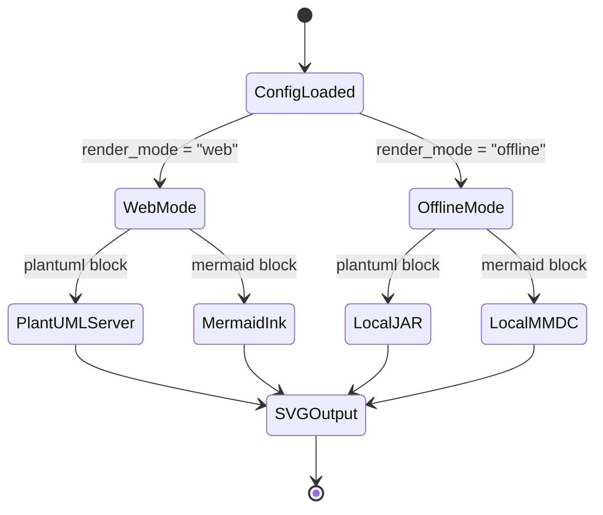

# Scribpy — Architecture Overview


Welcome to the **Scribpy** architecture documentation. This document
demonstrates the full HTML export pipeline with images, diagrams, and
table of contents.

## Technology Stack


Scribpy is built with Python 3.13+ and leverages:

- **markdown-it-py** — CommonMark-compliant Markdown parsing
- **PlantUML** — UML diagram rendering (web mode)
- **Mermaid** — Flowchart and sequence diagram rendering (web mode)

## System Architecture

The following PlantUML diagram shows the high-level architecture:



## Data Flow

Here is the Mermaid representation of the data transformation pipeline:



## Module Responsibilities

| Module | Responsibility |
|--------|---------------|
| `core/markdown_parser.py` | Parse Markdown to structured document |
| `core/image_resolver.py` | Verify image existence |
| `core/diagram_renderer.py` | Dispatch rendering by engine × mode |
| `render/html_renderer.py` | Produce self-contained HTML page |
| `render/toc_widget.py` | Generate interactive TOC menu |

## Sequence Diagram — HTML Export



## State Diagram — Render Mode Selection



## Configuration Example

```python
from scribpy import ScribpyConfig, RenderMode, DiagramConfig

config = ScribpyConfig(
    source=Path("docs/architecture.md"),
    output_dir=Path("dist/html"),
    diagrams=DiagramConfig(render_mode=RenderMode.WEB),
)
```

## Supported Markdown Features

This section demonstrates every GFM element rendered by Scribpy.

### Text Formatting

- **Bold text** with double asterisks
- *Italic text* with single asterisks
- ~~Strikethrough~~ with double tildes
- `Inline code` with backticks
- [Hyperlinks](https://github.com) are clickable

### Lists

#### Unordered list

- First item
- Second item
  - Nested item A
  - Nested item B
- Third item

#### Ordered list

1. Parse the Markdown source
2. Resolve all image references
3. Render diagram blocks via web API
4. Generate the final HTML output

#### Task list (GFM)

- [x] Implement Markdown parser
- [x] Add image resolver
- [x] Add diagram web renderers
- [ ] Implement PDF export
- [ ] Add CLI interface

### Blockquotes

> "Simplicity is the ultimate sophistication."
> — Leonardo da Vinci

> **Note:** Scribpy handles errors gracefully.
> A missing image or a failed diagram will not stop
> the processing of other elements.

### Code Block

```bash
# Install scribpy
uv add scribpy

# Export a Markdown file to HTML
scribpy export html docs/architecture.md --css style.css --toc --output dist/
```

### Horizontal Rule

---

### Definition-style Table

| Feature | Status | Notes |
|:--------|:------:|------:|
| HTML export | ✅ Done | Single page, self-contained |
| PDF export | 🚧 Planned | Via markdown-pdf |
| PlantUML (web) | ✅ Done | Public server |
| Mermaid (web) | ✅ Done | mermaid.ink |
| PlantUML (offline) | ⏳ Pending | Requires Java |
| Mermaid (offline) | ⏳ Pending | Requires mmdc |
| TOC widget | ✅ Done | Hamburger menu |
| Custom CSS | ✅ Done | User-supplied stylesheet |

## Conclusion

Scribpy transforms Markdown into polished, self-contained HTML documents
with embedded diagrams and interactive navigation — all from a simple
command line invocation.

> Built with ❤️ in Python 3.13+
