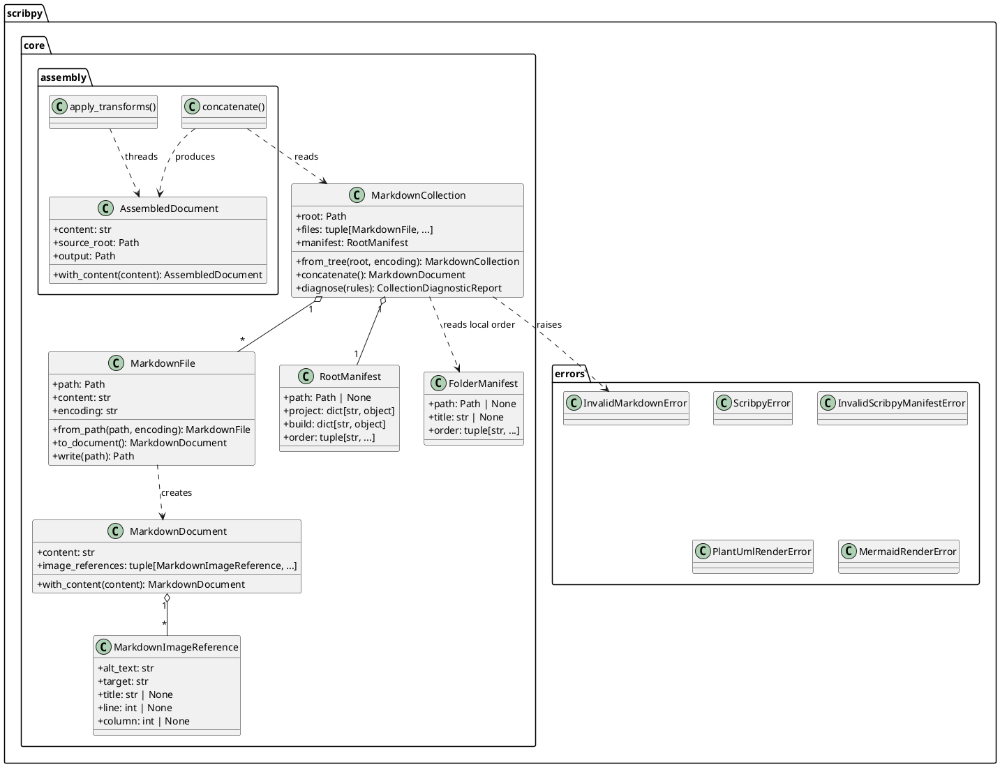
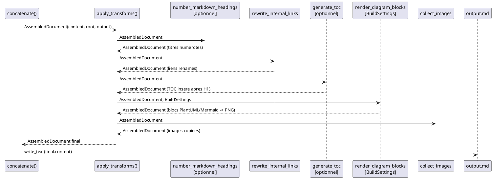
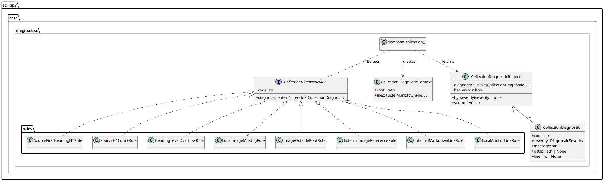
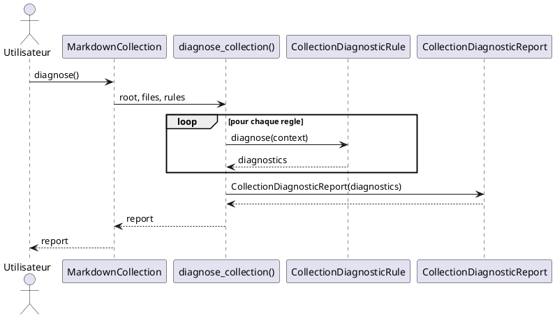
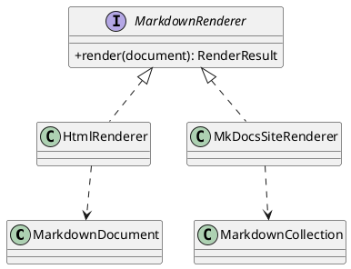
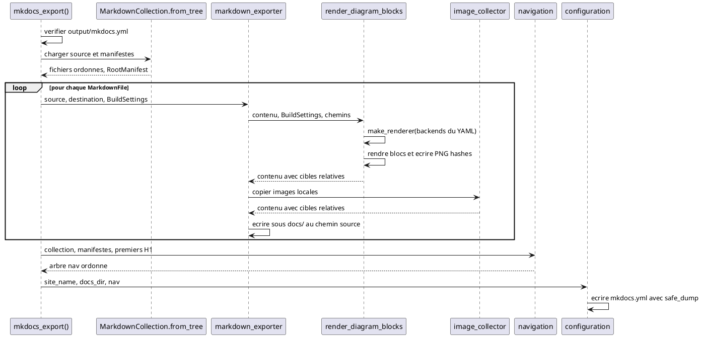

# Scribpy Core — Architecture

## Objectif

Scribpy assemble des collections de fichiers Markdown en un document unique pret
a la publication. Le noyau produit un fichier Markdown enrichi : les liens
internes sont renames en ancres, les blocs de diagrammes sont rendus en PNG et
les images locales sont copiees dans un repertoire d'assets.

L'objet metier central cote disque est `MarkdownFile`. Cote memoire c'est
`MarkdownDocument`. Le resultat de l'assemblage est `AssembledDocument`, qui
porte l'etat en cours de transformation le long du pipeline.

## Principes

- `MarkdownFile` represente un fichier Markdown physique avec son chemin.
- `MarkdownDocument` represente du contenu Markdown en memoire, sans chemin.
- `MarkdownImageReference` represente une reference d'image ecrite dans le
  Markdown, pas encore un fichier resolu sur disque.
- `MarkdownCollection` represente une liste ordonnee de fichiers Markdown
  chargee depuis une arborescence.
- `AssembledDocument` porte le contenu en cours de transformation et les
  chemins necessaires a la resolution des assets.
- Les modifications retournent une nouvelle instance pour faciliter les tests
  et eviter les effets de bord.
- `diagram_encoding` est generique : il encode n'importe quelle source de
  diagramme en chaine URL-safe (zlib + base64url). Les modules `kroki.py`
  sont les seuls a connaitre l'URL et le protocole du service kroki.io.
- Chaque backend de rendu est un module independant. La factory `make_renderer`
  est le seul endroit qui connaît la correspondance nom → classe.

## Vue statique des modules principaux



## Configuration : scribpy.yml

Le `scribpy.yml` racine est le seul manifeste riche. Il peut contenir les
metadonnees du projet, les reglages globaux et l'ordre des enfants directs :

```yaml
project:
  title: Guide utilisateur
build:
  toc: true
  heading_numbering:
    enabled: true
  plantuml_backend: web
  mermaid_backend: web
order:
  - intro.md
  - architecture/
```

Les cles supportees dans `build` :

| Cle | Type | Defaut | Description |
|-----|------|--------|-------------|
| `toc` | boolean | `false` | Insere une table des matieres apres le H1 du document assemble |
| `heading_numbering.enabled` | boolean | `true` si le bloc est present | Deleguee a MkForge (voir ADR-001) |
| `renumber_headings` | boolean | — | Alias legacy de `heading_numbering.enabled` |
| `plantuml_backend` | string | `"web"` | Backend de rendu PlantUML (`"web"` via kroki.io, `"local"` non implemente) |
| `mermaid_backend` | string | `"web"` | Backend de rendu Mermaid (`"web"` via kroki.io, `"local"` non implemente) |

Les `scribpy.yml` de dossier sont limites a `title` et `order` :

```yaml
title: Architecture
order:
  - contexte.md
  - decisions.md
```

Chaque manifeste controle uniquement les enfants directs de son dossier. Si un
enfant liste dans `order` n'existe pas, une `InvalidScribpyManifestError` est
levee. Les enfants non listes dans un manifeste emettent un
`ScribpyManifestWarning` et sont ignores. Sans manifeste, les enfants sont
parcourus par ordre alphabetique.

## Flux d'assemblage

L'assemblage passe par deux etapes : la concatenation, puis le pipeline de
transforms.

### Etape 1 — Concatenation

`MarkdownCollection.concatenate()` produit un `MarkdownDocument` normalise :

- un seul H1 global derive de `project.title` ou du nom du dossier racine ;
- un titre intermediaire pour chaque dossier traverse ;
- les titres de chaque fichier source decales via `HeadingNormalizer` ;
- les blocs code fenced sont ignores par le scanner de lignes.

Si les diagnostics de collection contiennent au moins une erreur, la
concatenation leve `InvalidMarkdownError` avant de produire du contenu.

### Etape 2 — Pipeline de transforms

`concatenate()` (module `scribpy.core.assembly.concatenate`) orchestre les
transforms appliquees en sequence par `apply_transforms` :

| Ordre | Transform | Conditionnel | Role |
|-------|-----------|--------------|------|
| 1 | `number_markdown_headings` | `build.heading_numbering.enabled` | Numerote les titres via MkForge |
| 2 | `rewrite_internal_links` | toujours | Remplace `[label](file.md)` par `[label](#slug)` |
| 3 | `generate_toc` | `build.toc: true` | Insere un TOC apres le H1 du document assemble |
| 4 | `render_diagram_blocks` | toujours | Rend les blocs PlantUML et Mermaid en PNG selon `BuildSettings` |
| 5 | `collect_images` | toujours | Copie les images locales dans `assets/` |

Le TOC est positionne apres la reecriture des liens (etape 2) pour que ses
ancres soient coherentes avec celles produites par le link rewriter. Si le
numbering est actif (etape 1), `generate_toc` lit les titres deja numerotes
et produit des slugs identiques a ceux du document final.

Chaque PNG genere est nomme d'apres le SHA-256 de la source du diagramme. Les
diagrammes identiques partagent ainsi un seul fichier sans recalcul.



## Renderers de diagrammes

### Architecture commune

PlantUML et Mermaid partagent la meme architecture a trois couches :
protocole, factory, backends.

```plantuml
@startuml
skinparam classAttributeIconSize 0

package "scribpy.core.plantuml" {
  interface PlantUmlRenderer {
    +render(diagram: str): bytes
  }
  class "make_renderer(backend)" as puml_factory
  class KrokiRenderer as puml_kroki
  class LocalRenderer as puml_local
}

package "scribpy.core.mermaid" {
  interface MermaidRenderer {
    +render(diagram: str): bytes
  }
  class "make_renderer(backend)" as mmid_factory
  class KrokiRenderer as mmid_kroki
  class LocalRenderer as mmid_local
}

package "scribpy.core" {
  class "diagram_encoding.encode_diagram()" as encoder
}

PlantUmlRenderer <|.. puml_kroki
PlantUmlRenderer <|.. puml_local
puml_factory ..> PlantUmlRenderer : instantiates
puml_kroki ..> encoder : uses

MermaidRenderer <|.. mmid_kroki
MermaidRenderer <|.. mmid_local
mmid_factory ..> MermaidRenderer : instantiates
mmid_kroki ..> encoder : uses
@enduml
```

### Encodage des diagrammes

`diagram_encoding.encode_diagram(diagram)` est generique et ne depend d'aucun
service. Il compresse la source UTF-8 avec zlib (niveau 9) puis encode en
base64url. Cette chaine est ensuite utilisee dans l'URL GET envoyee a kroki.io.
Tout ce qui est specifique a kroki.io (URL de base, timeout, User-Agent,
interpretation de la reponse HTTP) reste dans les modules `kroki.py`.

### Backend web (kroki.io)

Les `KrokiRenderer` envoient une requete GET a `https://kroki.io/<format>/png/<encoded>`.
En cas d'erreur HTTP ou reseau, ils levent `PlantUmlRenderError` ou
`MermaidRenderError`. Aucune dependance externe n'est requise au-dela de la
stdlib Python.

### Backend local (placeholder)

Les `LocalRenderer` existent comme placeholder pour permettre a la factory et
a la configuration de les referencer sans erreur. Ils levent
`NotImplementedError` a chaque appel. L'implementation locale est prevue dans
une version ulterieure.

## Diagnostics de collection

Les diagnostics appliquent le pattern Strategy : chaque controle est une regle
independante qui implemente le protocole `CollectionDiagnosticRule`. Le moteur
`diagnose_collection` leur passe un `CollectionDiagnosticContext` et agregge
les resultats dans un `CollectionDiagnosticReport`.



### Regles du registre par defaut

| Code | Severite | Role |
|------|----------|------|
| `SOURCE_FIRST_HEADING_NOT_H1` | ERROR | Le premier titre de chaque source doit etre H1 |
| `SOURCE_H1_COUNT_INVALID` | ERROR | Chaque source doit contenir exactement un H1 |
| `HEADING_LEVEL_OVERFLOW` | ERROR | Detecte les titres qui depasseraient H6 apres decalage |
| `LOCAL_IMAGE_MISSING` | ERROR | Images locales dont le fichier n'existe pas |
| `IMAGE_OUTSIDE_ROOT` | ERROR | Images locales qui echappent a la racine de collection |
| `EXTERNAL_IMAGE_REFERENCE` | WARNING | Images externes (pas de requete reseau) |
| `INTERNAL_MARKDOWN_LINK_RULE` | ERROR | Liens vers fichiers Markdown inexistants ou hors racine |
| `LOCAL_ANCHOR_LINK` | ERROR | Liens avec fragment d'ancre (#section) interdits en source |

`concatenate()` bloque uniquement sur les diagnostics de severite `ERROR`. Les
`WARNING` restent consultables via `MarkdownCollection.diagnose()` mais ne
bloquent pas l'assemblage.

De nouveaux controles peuvent etre ajoutes comme nouvelles regles sans modifier
le moteur. Chaque regle concrete vit dans son propre module sous
`scribpy.core.diagnostics.rules`.

## Flux de diagnostic



## Decisions de conception

- **Adaptateur** : `MarkdownFile` expose une API metier stable et deleguait
  initialement les controles Markdown a `mkforge`. Les controles de collection
  sont desormais dans `scribpy.core.diagnostics`.
- **Prototype immuable** : `MarkdownDocument` et `AssembledDocument` retournent
  une nouvelle instance a chaque modification. Pas d'effet de bord, tests simples.
- **Pipeline fonctionnel** : `apply_transforms` applique une sequence de fonctions
  `TransformFn` de type `AssembledDocument -> AssembledDocument`. Chaque transform
  est independant et testable seul.
- **Strategy + Registry** : les regles de diagnostic implementent un protocole
  commun. Le registre par defaut `DEFAULT_COLLECTION_DIAGNOSTIC_RULES` liste
  les regles actives sans condition centrale.
- **Isolation du backend** : `diagram_encoding` est generique. Tout ce qui
  concerne kroki.io (URL, HTTP, format de reponse) reste dans les modules `kroki.py`.

## Extension prevue

Les futurs rendeurs (HTML, MkDocs) utiliseront le pattern Strategy afin d'ajouter
des sorties sans modifier les objets Markdown de base. Le backend `local` pour
PlantUML et Mermaid sera implemente dans une version ulterieure.



## Export MkDocs

### Modules affectes

L'export MkDocs ajoute un adaptateur de sortie arborescent sans modifier le
modele `MarkdownCollection` ni le pipeline d'assemblage.

| Module | Evolution |
|---|---|
| `scribpy.core.mkdocs.__init__` | Nouvelle orchestration et API publique `mkdocs_export()` |
| `scribpy.core.mkdocs.markdown_exporter` | Export unitaire des sources Markdown et appel des services d'assets partages |
| `scribpy.core.mkdocs.navigation` | Construction de la navigation ordonnee et hierarchique |
| `scribpy.core.mkdocs.configuration` | Ecriture de `mkdocs.yml` avec PyYAML |
| `scribpy.core.diagram_blocks` | API unique de rendu des blocs PlantUML et Mermaid configuree par `BuildSettings` |
| `scribpy.core.image_collector` | Service neutre partage de collecte des images locales |
| `scribpy.core.assembly.concatenate` | Remplacement des deux fonctions de diagramme par l'import direct de l'API partagee |
| `scribpy.core.assembly.image_collector` | Reexport de compatibilite du collecteur neutre |
| `scribpy.core.__init__` | Reexport de `mkdocs_export` |

`scribpy.core.mkdocs` ne depend pas de `scribpy.core.assembly`. Les services
d'assets partages dependent de chemins, de contenu Markdown et de
`BuildSettings` ; ils ne connaissent ni `AssembledDocument` ni MkDocs.

Le merge et l'export MkDocs utilisent exactement l'import suivant :

```python
from scribpy.core.diagram_blocks import render_diagram_blocks
```

Cette fonction reçoit le `BuildSettings` chargé depuis le manifeste racine.
Elle est le seul endroit qui traduit les options YAML de diagrammes en choix de
factories et de backends. Il n'existe pas de fonction de rendu propre au merge
ou à MkDocs.

### Interfaces publiques

```python
def mkdocs_export(source: Path, output: Path) -> None:
    """Exporte un projet Scribpy vers une arborescence lisible par MkDocs."""
```

La fonction est exposee par `scribpy.core.mkdocs` et reexportee par
`scribpy.core`. Les interfaces publiques existantes de l'assembly restent
inchangees. Si `output/mkdocs.yml` existe avant l'appel,
`ScaffoldCollisionError` est levee avant toute ecriture.

### Flux de donnees



Les liens Markdown internes ne sont jamais presentes a un rewriter. Les
headings ne sont ni normalises ni numerotes. Les chemins de fichiers conserves
dans `docs/` sont relatifs a la racine de collection ; les chemins YAML sont
convertis au format POSIX. Les references d'assets sont calculees relativement
au parent de chaque Markdown de destination.

### Gestion des erreurs

- `ScaffoldCollisionError` protege un `mkdocs.yml` existant avant toute
  mutation.
- Les erreurs de chargement ou de schema des manifestes sont propagees par
  `MarkdownCollection.from_tree`.
- `PlantUmlRenderError`, `MermaidRenderError` et `NotImplementedError` des
  backends sont propagees sans conversion.
- Les erreurs de lecture, copie, creation de repertoire et ecriture restent
  des erreurs standard d'I/O.
- Les images externes et les references locales introuvables restent
  inchangees ; la validation de projet est responsable de les diagnostiquer.

### Strategie de test

Les tests unitaires mockent toute lecture/ecriture, copie et tout renderer
externe. Ils couvrent le garde de collision, la selection des deux backends,
le hash et la deduplication des diagrammes, la resolution d'image relative au
fichier source, les collisions de noms, les references depuis plusieurs
profondeurs, l'extraction du premier H1 hors blocs fenced, les titres de groupe
avec et sans manifeste, l'ordre recursif et la serialisation YAML.

Les tests de regression garantissent que `concatenate()` et `mkdocs_export()`
appellent la même fonction `render_diagram_blocks` avec le `BuildSettings` de
leur collection. Ils vérifient que les deux backends configurés dans le YAML
sont transmis aux factories pour les deux workflows. Un test d'architecture
interdit toute autre fonction de rendu de blocs dans l'assembly ainsi que les
imports de `scribpy.core.assembly`, `mkdocs` et des moteurs de template depuis
le nouveau package.

Au moins un test d'integration exporte sans mock interne un projet temporaire
avec fichiers imbriques, liens Markdown, images et diagrammes rendus par des
renderers de test injectes au point de factory. Il verifie l'arbre produit et
recharge `mkdocs.yml` avec `yaml.safe_load`. L'ensemble doit maintenir 100 % de
coverage et passer `make check`.
