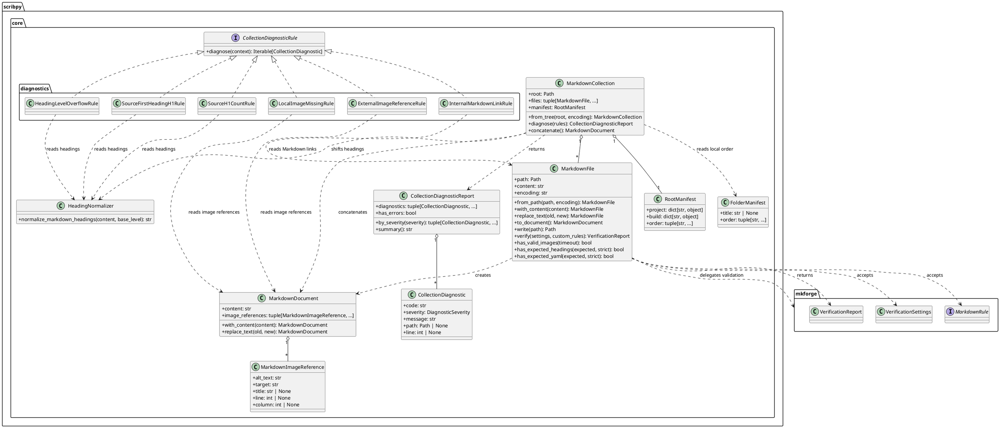
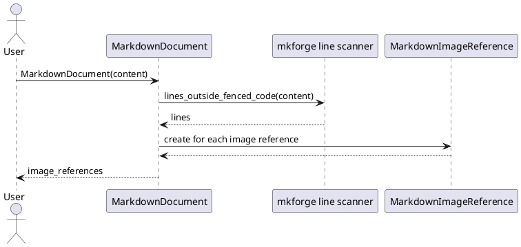
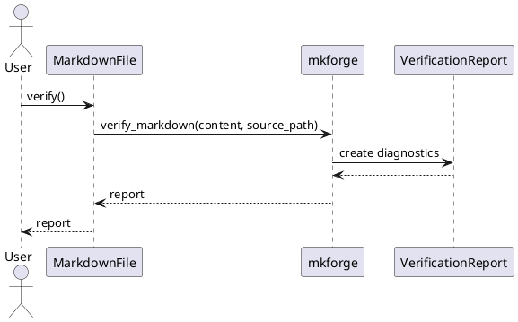
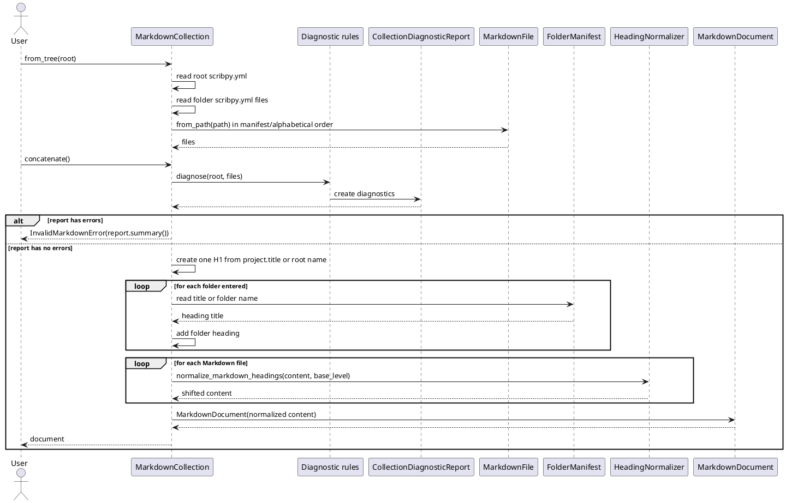
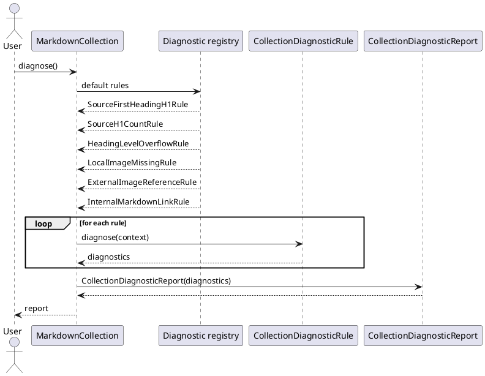
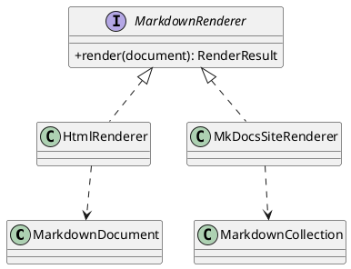

# Scribpy Core Architecture

## Objectif

Scribpy repart d'un noyau simple : un fichier Markdown est l'objet metier
central quand on manipule le disque, et un document Markdown est l'objet metier
central quand on manipule du contenu en memoire. Les fonctions Markdown
generiques ne sont pas reecrites dans Scribpy : elles sont deleguees a
`mkforge` quand le package les expose.

## Principes

- `MarkdownFile` represente un fichier Markdown physique avec son chemin.
- `MarkdownDocument` represente du contenu Markdown en memoire, sans chemin.
- `MarkdownImageReference` represente une image ecrite dans le Markdown, pas
  encore un fichier resolu sur disque.
- `MarkdownCollection` represente une liste ordonnee de fichiers Markdown
  chargee depuis une arborescence.
- Les modifications retournent une nouvelle instance pour faciliter les tests
  et eviter les effets de bord.
- `mkforge` est l'adaptateur de verification et validation Markdown.
- Les rendus HTML, site et qualite multi-fichiers resteront des services
  separes pour eviter que les objets Markdown deviennent des objets qui font
  tout.

## Limite volontaire

`MarkdownDocument` extrait les references d'images, mais ne controle pas que les
fichiers existent. Cette verification demande un contexte disque. Elle restera
donc dans `MarkdownFile` ou dans un futur service de qualite documentaire.

## Vue statique



## Ordre des fichiers

`MarkdownCollection.from_tree()` parcourt recursivement les dossiers et
sous-dossiers, garde les fichiers `.md` et `.markdown`, puis applique les
manifests `scribpy.yml` quand ils existent.

Le `scribpy.yml` racine est le seul manifeste riche. Il peut contenir les
metadonnees du projet, les reglages globaux et l'ordre des enfants directs de la
racine :

```yaml
project:
  title: Guide utilisateur
build:
  toc: true
  renumber_headings: false
order:
  - intro.md
  - architecture/
```

Les `scribpy.yml` de dossier sont locaux et limites a `title` et `order` :

```yaml
title: Architecture
order:
  - contexte.md
  - decisions.md
```

Chaque manifeste controle uniquement les enfants directs de son dossier :

```text
docs/
  scribpy.yml
  intro.md
  architecture/
    scribpy.yml
    contexte.md
    decisions.md
```

Si un dossier n'a pas de `scribpy.yml`, ses enfants directs sont parcourus par
ordre alphabetique. Si un dossier definit des reglages globaux comme `build`,
ils produisent un `ScribpyManifestWarning` et sont ignores. Si un manifeste
liste un enfant inexistant ou un chemin profond comme `guide/install.md`, une
erreur `InvalidScribpyManifestError` est levee.

## Flux d'extraction des images



## Flux de verification fichier



## Flux de concatenation v1



La concatenation produit un document Markdown structure pour publication :

- le document final contient un seul titre de niveau 1 ;
- ce titre vient de `project.title` dans le `scribpy.yml` racine, ou du nom du
  dossier racine si la metadonnee est absente ;
- chaque dossier traverse ajoute un titre intermediaire, avec le `title` du
  `scribpy.yml` local quand il existe, sinon le nom du dossier ;
- le titre `#` d'un fichier racine devient `##`, le titre `#` d'un fichier dans
  un sous-dossier devient `###`, et ainsi de suite ;
- les titres situes dans les blocs de code fenced ne sont pas modifies, grace au
  scanner de lignes fourni par `mkforge`.

## Flux de diagnostic collection



Les diagnostics de collection appliquent le pattern Strategy : chaque controle
est une regle independante qui implemente `CollectionDiagnosticRule`. Le registre
par defaut contient aujourd'hui :

- `SourceFirstHeadingH1Rule`, qui verifie que le premier titre Markdown de
  chaque fichier source est un H1 ;
- `SourceH1CountRule`, qui verifie que chaque fichier source contient
  exactement un titre H1 ;
- `HeadingLevelOverflowRule`, qui detecte les titres qui depasseraient le
  niveau 6 apres insertion du H1 racine et des titres de dossiers.
- `LocalImageMissingRule`, qui signale en erreur les images locales dont le
  fichier n'existe pas, en resolvant les chemins relatifs depuis le fichier
  Markdown source ;
- `ExternalImageReferenceRule`, qui signale en warning les images externes sans
  effectuer de requete reseau dans le noyau deterministe.
- `InternalMarkdownLinkRule`, qui signale en erreur les liens vers fichiers
  Markdown inexistants ou les liens Markdown qui sortent de la racine de
  collection. Les URL externes, les ancres seules et les liens non Markdown sont
  ignores par cette regle.

De nouveaux controles, comme les images absentes ou les liens casses, peuvent
etre ajoutes par nouvelle regle sans modifier le moteur. Chaque regle concrete
vit dans son propre module sous `scribpy.core.diagnostics.rules` afin d'eviter
un fichier central difficile a maintenir.

`MarkdownCollection.concatenate()` bloque seulement sur les diagnostics de
severite `ERROR`. Les diagnostics de severite `WARNING`, par exemple les images
externes, restent consultables avec `collection.diagnose()` mais ne bloquent pas
l'assemblage.

## Extension prevue

Les futurs rendus utiliseront le pattern Strategy afin d'ajouter HTML, MkDocs
ou d'autres sorties sans modifier les objets Markdown de base.



## Decision de conception

Le premier design pattern applique est l'adaptateur : `MarkdownFile` expose une
API metier stable pour Scribpy et delegue les controles Markdown a `mkforge`.
`MarkdownDocument` applique une approche de prototype immuable : chaque
modification retourne un nouveau document avec ses references derivees
recalculees. `MarkdownCollection` applique une strategie d'ordre simple en v1
basee sur `scribpy.yml`, avec repli alphabetique lorsqu'un dossier n'a pas de
manifeste. Les diagnostics de collection appliquent Strategy et Registry :
`MarkdownCollection` depend d'une interface de regle, et le registre par defaut
permet d'ajouter des controles sans etendre une grande condition centrale.
