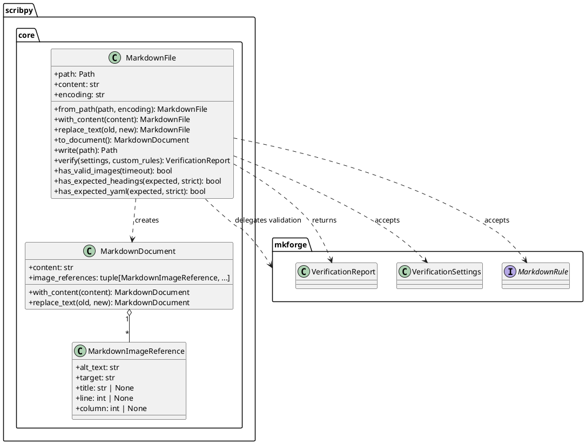
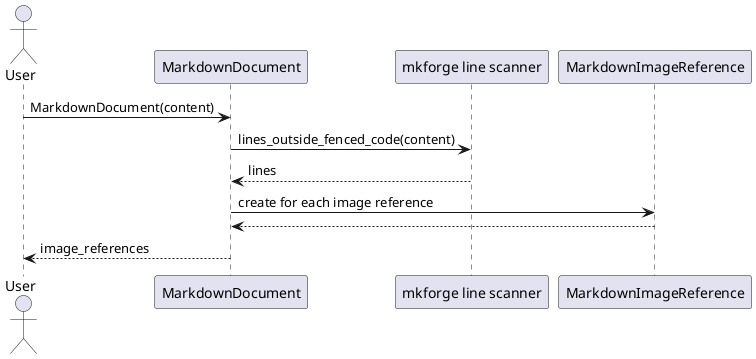
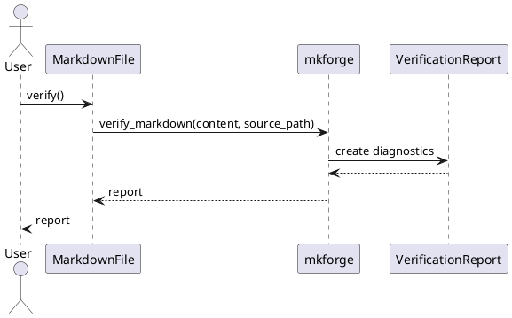
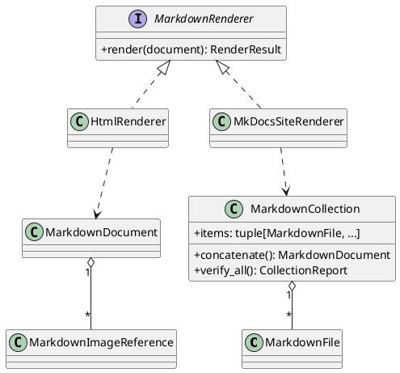

# Scribpy Core Architecture

## Objectif

Scribpy repart d'un noyau simple : un fichier Markdown est l'objet metier
central quand on manipule le disque, et un document Markdown est l'objet metier
central quand on manipule du contenu en memoire. Les fonctions Markdown
generiques ne sont pas reecrites dans Scribpy : elles sont deleguees a
`mkforge` quand le package les expose.

## Principes

- `MarkdownFile` represente un fichier Markdown physique avec son chemin.
- `MarkdownDocument` represente du contenu Markdown en memoire, sans chemin.
- `MarkdownImageReference` represente une image ecrite dans le Markdown, pas
  encore un fichier resolu sur disque.
- Les modifications retournent une nouvelle instance pour faciliter les tests
  et eviter les effets de bord.
- `mkforge` est l'adaptateur de verification et validation Markdown.
- Les rendus HTML, site et qualite multi-fichiers resteront des services
  separes pour eviter que les objets Markdown deviennent des objets qui font
  tout.

## Limite volontaire

`MarkdownDocument` extrait les references d'images, mais ne controle pas que les
fichiers existent. Cette verification demande un contexte disque. Elle restera
donc dans `MarkdownFile` ou dans un futur service de qualite documentaire.

## Vue statique

## Flux d'extraction des images

## Flux de verification fichier

## Extension prevue

## Decision de conception

Le premier design pattern applique est l'adaptateur : `MarkdownFile` expose une
API metier stable pour Scribpy et delegue les controles Markdown a `mkforge`.
`MarkdownDocument` applique une approche de prototype immuable : chaque
modification retourne un nouveau document avec ses references derivees
recalculees. Les futurs rendus utiliseront le pattern Strategy afin d'ajouter
HTML, MkDocs ou d'autres sorties sans modifier les objets Markdown de base.
