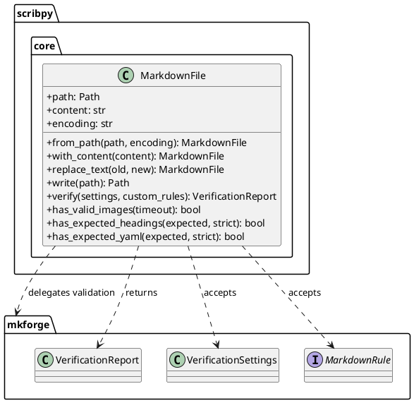
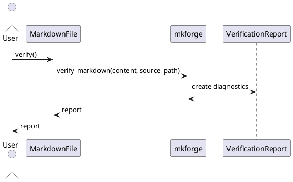
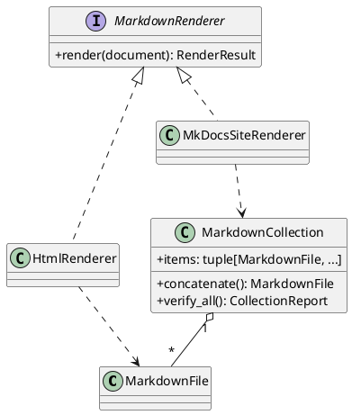

# Scribpy Core Architecture

## Objectif

Scribpy repart d'un noyau simple : un fichier Markdown est l'objet metier
central. Il porte son chemin, son contenu et les operations locales qui ont du
sens sur un seul fichier. Les fonctions Markdown generiques ne sont pas
reecrites dans Scribpy : elles sont deleguees a `mkforge`.

## Principes

- `MarkdownFile` represente un fichier Markdown charge ou construit en memoire.
- Les modifications retournent une nouvelle instance pour faciliter les tests
  et eviter les effets de bord.
- `mkforge` est l'adaptateur de verification et validation Markdown.
- Les rendus HTML, site et qualite multi-fichiers resteront des services
  separes pour eviter que `MarkdownFile` devienne un objet qui fait tout.

## Vue statique

## Flux de verification

## Extension prevue

## Decision de conception

Le premier design pattern applique est l'adaptateur : `MarkdownFile` expose une
API metier stable pour Scribpy et delegue les controles Markdown a `mkforge`.
Les futurs rendus utiliseront le pattern Strategy afin d'ajouter HTML, MkDocs
ou d'autres sorties sans modifier l'objet Markdown de base.
