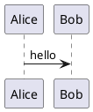

# Markdown Guide

This page documents the Markdown conventions that Scribpy expects and
recommends. Following these conventions ensures that Scribpy can parse,
lint, transform, and export your documents correctly.

---

## File structure conventions

### One `# H1` per file — required

Every Markdown file **must** begin with exactly one top-level `# H1` heading.
This heading is used as the document title and as the top-level entry in the
table of contents.

```markdown
# My Document Title

Introduction paragraph here.
```

Scribpy's lint rule `LINT001` reports an error if no `# H1` is found.

### Heading hierarchy — no level skipping

Headings must not skip levels. After a `# H1` the next heading must be
`## H2`, not `### H3`.

```markdown
# Overview           ✔ H1
## Installation      ✔ H2
### Prerequisites    ✔ H3
## Configuration     ✔ H2 (back up from H3 is fine)
```

```markdown
# Overview           ✔ H1
### Setup            ✗ Error — skipped H2
```

Scribpy's lint rule `LINT002` reports a warning when a level is skipped.

### Frontmatter

Optional YAML or TOML frontmatter is supported. It must appear at the very top
of the file, before the `# H1` heading.

```markdown
---
title: My Page
author: Jane Doe
date: 2026-01-15
---

# My Page
```

Frontmatter values are accessible on `Document.frontmatter` in the Python API.
Scribpy recovers gracefully from malformed frontmatter and reports a warning
diagnostic.

---

## Internal links

Internal links must use **relative paths** from the source file to the target
file. The path must match an indexed source file exactly.

```markdown
<!-- From doc/guide/overview.md, linking to doc/guide/configuration.md -->
See the [Configuration guide](configuration.md).

<!-- Linking to a file in a parent directory -->
Back to [Index](../index.md).

<!-- Linking to a heading anchor -->
See [Installation steps](installation.md#prerequisites).
```

Scribpy's lint rule `LINT003` reports an error if the target file does not
exist in the document index.

!!! warning "Absolute paths are not resolved"
    Links starting with `/` are treated as external URLs and are not validated
    by Scribpy. Use relative paths for all cross-document references.

---

## Images and local assets

Image references using relative paths are validated by Scribpy. The asset must
exist on disk relative to the source file.

```markdown


```

Scribpy's lint rule `LINT004` reports an error if the referenced file does not
exist.

### Recommended asset organisation

```
doc/
├── index.md
├── guide/
│   ├── overview.md
│   └── assets/           ← assets co-located with the guide
│       └── diagram.png
└── assets/               ← shared assets at the source root
    └── logo.svg
```

---

## Cross-references

To link to a heading within the assembled document (rather than a specific
file), use the `xref:` protocol (when supported by your Scribpy version):

```markdown
See [the configuration section](xref:configuration).
```

For standard internal links between files, use relative file paths as described
above.

---

## Code blocks

Use fenced code blocks with a language identifier for syntax highlighting:

````markdown
```python
def greet(name: str) -> str:
    return f"Hello, {name}!"
```

```bash
scribpy build html --mode site --root my-project
```

```toml
[project]
name = "My Project"
```
````

---

## PlantUML diagrams

Scribpy renders fenced `plantuml` blocks locally when building HTML:

````markdown

````

By default, the PlantUML JAR is bundled with Scribpy and the diagram source is
never sent to an external service. Rendering still requires a local Java runtime
because the embedded PlantUML engine is executed by the JVM.

Projects may opt into web rendering instead:

```toml
[builders.html.plantuml]
renderer = "web"
server_url = "http://www.plantuml.com/plantuml"
```

Web rendering is convenient when Java is unavailable, but the diagram source is
sent to the configured server. Keep the default local mode for confidential
documentation or offline use.

For HTML builds, Scribpy writes deterministic SVG files below the generated
`assets/diagrams/` directory and replaces each source block with a local image
reference in the generated output.

---

## Tables

Use standard GFM (GitHub Flavored Markdown) table syntax:

```markdown
| Column A | Column B | Column C |
|---|---|---|
| Value 1  | Value 2  | Value 3  |
| Value 4  | Value 5  | Value 6  |
```

Alignment modifiers are supported:

```markdown
| Left | Centre | Right |
|:---|:---:|---:|
| abc | def | ghi |
```

---

## Admonitions (site mode)

When building in `site` mode with MkDocs Material, you can use admonitions:

```markdown
!!! note
    This is a note admonition.

!!! warning "Custom title"
    This is a warning with a custom title.

!!! tip
    Tip admonition.
```

!!! note
    Admonitions are rendered by MkDocs and are not processed by Scribpy's
    transforms. They appear as plain blockquotes in `single-page` and
    `markdown` output.

---

## Recommendations summary

| Rule | Required | Enforced by |
|---|---|---|
| One `# H1` per file | Yes | `LINT001` |
| No heading level skipping | Recommended | `LINT002` (warning) |
| Relative paths for internal links | Yes | `LINT003` |
| Relative paths for local assets | Yes | `LINT004` |
| Frontmatter at top of file | Optional | — |
| Language tags on code blocks | Recommended | — |
| Explicit index for ordered output | Recommended for manuals | — |

---

## Structuring a multi-file project

For documentation projects with multiple files, follow this structure:

```
doc/
├── index.md              ← project entry point, # H1 = project title
├── installation.md       ← ## H2 sections for sub-topics
├── configuration.md
├── reference/
│   ├── api.md
│   └── cli.md
└── assets/
    └── logo.png
```

With `scribpy.toml`:

```toml
[index]
mode = "explicit"
files = [
    "index.md",
    "installation.md",
    "configuration.md",
    "reference/api.md",
    "reference/cli.md",
]
```

When Scribpy assembles this into a single document, it normalises heading levels
so that each file's `# H1` becomes a top-level section of the final document.
Sub-headings are adjusted accordingly.
