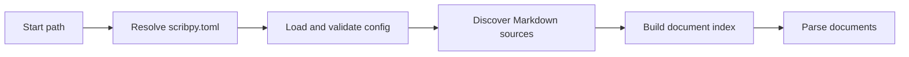

# Functional Pipelines

Scribpy is easier to use when you understand which stages each command runs.
The CLI reports these stages in real time during execution.

## Shared project preparation pipeline

Every command except `index check` runs this preparation pipeline first:



The pipeline accumulates diagnostics at each stage. If any stage produces an
error diagnostic, subsequent stages are skipped.

---

## `index check`


`index check` intentionally stops before parsing Markdown content. It is the
fastest way to validate project layout and index configuration — useful as a
quick pre-flight check in CI before a full build.

**What is validated:**

1. `scribpy.toml` can be found and loaded;
2. `paths.source` stays inside the project root;
3. Markdown files are discovered deterministically;
4. explicit index entries are valid, non-duplicated, and present on disk;
5. unindexed discovered files are reported as warnings when using `hybrid` mode.

---

## `parse check`


`parse check` runs the full preparation pipeline and reports the number of
parsed documents. Diagnostics at this stage are typically warnings for malformed
frontmatter that can be recovered from.

---

## `lint`


All built-in lint rules run sequentially. The lint context makes every parsed
document available to every rule, enabling cross-document checks such as broken
internal link detection.

**Built-in rules:**

| Code | Rule | Severity |
|---|---|---|
| `LINT001` | Missing `# H1` heading | error |
| `LINT002` | Heading hierarchy violation (skipped level) | warning |
| `LINT003` | Broken internal link | error |
| `LINT004` | Missing local asset (image/file) | error |

---

## `build markdown`


**Markdown transforms applied (in order):**

1. Inject document title as `# H1` (if `document.title` is set)
2. Normalize heading levels across merged documents
3. Generate table of contents (if `document.toc.enabled = true`)
4. Apply section numbering (if `document.numbering.enabled = true`)
5. Resolve cross-references
6. Rewrite internal links for the assembled document

---

## `build html --mode single-page`


Produces one self-contained `index.html` with embedded or referenced CSS.
Images and other local assets are copied into the output directory.

**Default output:** `build/html/index.html`

---

## `build html --mode site`


Scribpy writes a `mkdocs.yml` and splits the assembled document into per-page
Markdown files, then delegates the static site rendering to MkDocs.

**Default output:** `build/site/site/`

---

## Diagnostics flow

All pipelines accumulate `Diagnostic` objects at every stage. A diagnostic
carries:

- `severity` — `"info"`, `"warning"`, or `"error"`
- `code` — stable identifier (e.g. `LINT001`)
- `message` — human-readable explanation
- `path` — optional source file path
- `line` — optional one-based line number
- `hint` — optional remediation guidance

An `"error"` diagnostic sets `failed = True` on the result object and, in the
CLI, causes exit code `1`. Warnings and info messages are reported but do not
block the build.

---

## Python API access to individual stages

The `scribpy.core` module exposes individual pipeline stages for advanced use:

```python
from scribpy.core import (
    parse_project_documents,
    lint_project,
    build_project,
)

# Run only up to parsing
parse_result = parse_project_documents("my-project")

# Run only the lint stage
lint_result = lint_project("my-project")

# Run a full build with a custom target
build_result = build_project("my-project", target="markdown")
```
