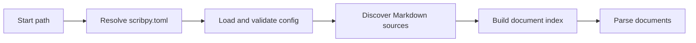

# Functional pipelines

Scribpy is easier to use when you know which stages each command runs. The CLI
reports these same large stages during execution.

## Shared project preparation pipeline

This shared pipeline is used by `parse check`, `lint`, and all build commands.
It accumulates diagnostics from configuration, project discovery, indexing, and
parsing.

## `index check`

`index check` intentionally stops before parsing Markdown content. It is the
fastest way to validate project layout and index configuration.

## `parse check`

## `lint`

## `build markdown`

## `build html --mode single-page`

## `build html --mode site`

