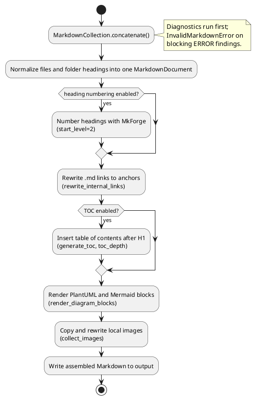
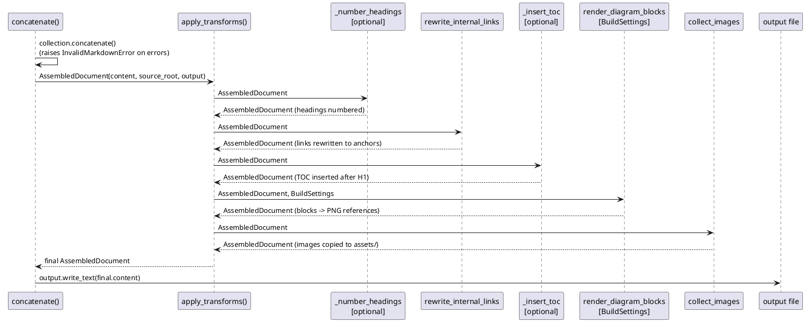

# Assembly pipeline

`MarkdownCollection.concatenate()` first creates one normalized in-memory
document. The public `concatenate(collection, output)` function (module
`scribpy.core.assembly.concatenate`) then threads an `AssembledDocument`
through pure transforms in a fixed order and writes the result to disk.



## Why this design

`apply_transforms()` (module `scribpy.core.assembly.pipeline`) implements a
functional pipeline: each `TransformFn` is `Callable[[AssembledDocument],
AssembledDocument]`, and `apply_transforms` simply folds the tuple of
transforms over the initial document, left to right. Each transform is a
free function (or a small closure over the manifest's `BuildSettings`) with
no dependency on the others — this makes every step independently unit
testable, and makes the pipeline order itself explicit and readable in one
place (`concatenate.py`), rather than scattered across conditionals. Adding a
step means writing a new pure function and inserting it into the tuple; it
does not require touching `apply_transforms()` or any other transform.

`AssembledDocument` follows the same immutable-prototype pattern as
`MarkdownDocument`: `with_content()` returns a new instance. This means a bug
in one transform cannot leak mutated state into a transform that runs before
it, and it makes each transform trivial to test with a hand-built
`AssembledDocument` and no filesystem.

## The `AssembledDocument` carrier

| Field | Type | Role |
|---|---|---|
| `content` | `str` | Markdown source text currently being transformed |
| `source_root` | `Path` | collection root, used to resolve relative image/link targets |
| `output` | `Path` | destination file path for the final assembled Markdown |

## Pipeline steps

| Order | Transform | Conditional on | Role |
|---|---|---|---|
| 1 | `_number_headings` (`mkforge.renumber_markdown_headings`) | `build.heading_numbering.enabled` | Numbers assembled headings via MkForge, `start_level=2` |
| 2 | `rewrite_internal_links` | always | Replaces `[label](file.md)` with `[label](#slug)` |
| 3 | `generate_toc` | `build.toc == True` | Inserts a Markdown list after the H1, up to `build.toc_depth` levels deep (default 3, i.e. H2–H4) |
| 4 | `render_diagram_blocks` | always | Renders fenced ` ```plantuml ` / ` ```mermaid ` blocks to PNG via the configured backends |
| 5 | `collect_images` | always | Copies local images into `output.parent/assets/` and rewrites their targets |

Step 3 runs after step 2 so that its slugs are computed the same way the link
rewriter computed them. When heading numbering (step 1) is active, the link
rewriter recomputes its slug map from the already-numbered content via
`build_numbered_file_slug_map()`, instead of the plain
`build_file_slug_map()`; this keeps the TOC and the rewritten links pointing
at the exact same anchors as the final numbered headings.

## Sequence



## Diagram rendering details

`render_diagram_blocks()` (module `scribpy.core.diagram_blocks`) is the
single shared entry point used by both the assembly pipeline and the MkDocs
exporter — see [Diagram renderers](diagram-renderers.md) for the backend
architecture. Each rendered PNG is named after the SHA-256 hex digest of its
diagram source (`png_filename()`), written under
`output.parent/assets/generated/`, and referenced with
``. Identical diagram sources
therefore share one generated file with no re-render, and unrelated diagrams
never collide.

## Example

```python
from pathlib import Path
from scribpy.core.markdown_collection import MarkdownCollection
from scribpy.core.assembly.concatenate import concatenate

collection = MarkdownCollection.from_tree(Path("docs-source"))
concatenate(collection, Path("build/output.md"))
# build/output.md now holds the assembled Markdown;
# build/assets/ and build/assets/generated/ hold copied images and PNGs.
```

`concatenate()` raises `PlantUmlRenderError` or `MermaidRenderError` if a
configured backend fails, and `NotImplementedError` if a `local` PlantUML
backend is selected (see [Diagram renderers](diagram-renderers.md)).
