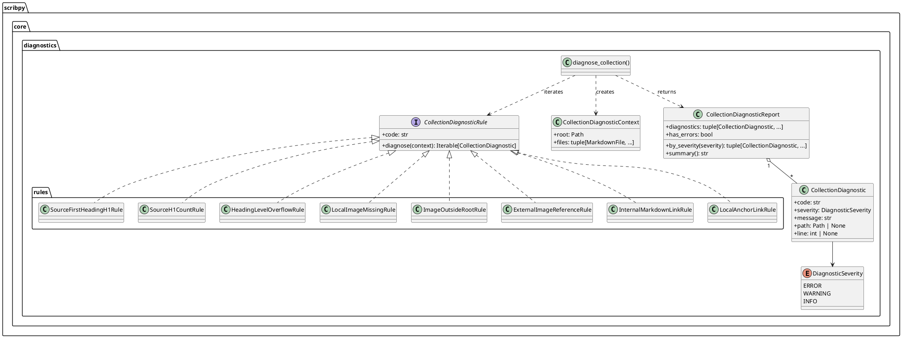
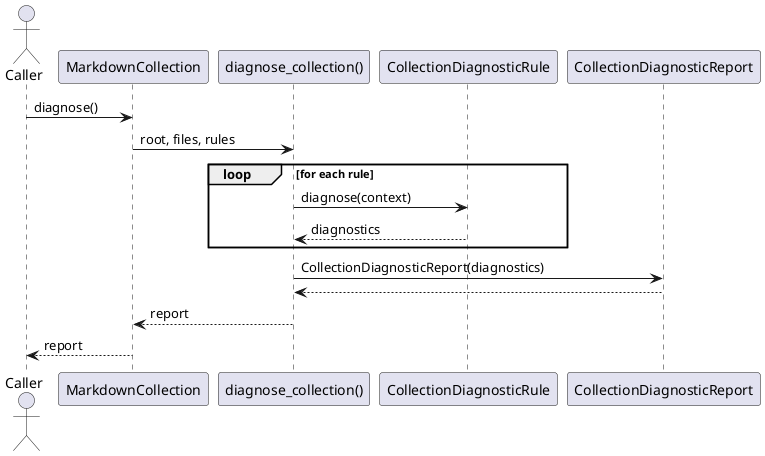

# Diagnostic engine

The engine builds one `CollectionDiagnosticContext` and runs each registered
rule against it. `diagnose_collection()` (module
`scribpy.core.diagnostics.engine`) does not know what any individual rule
checks — adding a rule never requires a change to the engine.



## Why this design

`CollectionDiagnosticRule` is a `Protocol` (structural typing, no base class
to inherit from), which keeps rules decoupled from each other and from the
engine — a Strategy pattern. `DEFAULT_COLLECTION_DIAGNOSTIC_RULES` in
`scribpy.core.diagnostics.engine` is a plain tuple of rule instances: a
Registry with no conditional dispatch logic. Every rule lives in its own
module under `scribpy.core.diagnostics.rules/`, has a single `code`
attribute, and implements one method, `diagnose(context) ->
Iterable[CollectionDiagnostic]`. This keeps each rule's reason to change
isolated to the one check it performs, and lets `MarkdownCollection.diagnose()`
accept a custom `rules` iterable for callers who want a different rule set —
for example, running a subset in an editor integration.

`CollectionDiagnosticContext` intentionally carries only `root` and `files`
— the two inputs every rule actually needs to resolve paths and scan
Markdown content. Rules do not receive the whole `MarkdownCollection`, which
keeps them from depending on manifest or pipeline concerns that are none of
their business.

## Sequence



## Default rules

| Code | Severity | Checks |
|---|---|---|
| `SOURCE_FIRST_HEADING_NOT_H1` | ERROR | The first heading in each source file must be H1 |
| `SOURCE_H1_COUNT_INVALID` | ERROR | Each source file must contain exactly one H1 heading |
| `HEADING_LEVEL_OVERFLOW` | ERROR | A heading would exceed Markdown level 6 once shifted by its folder depth during assembly |
| `LOCAL_IMAGE_MISSING` | ERROR | A local image reference points at a file that does not exist |
| `IMAGE_OUTSIDE_ROOT` | ERROR | A local image resolves outside the collection root (for example `../../outside/logo.png`) |
| `EXTERNAL_IMAGE_REFERENCE` | WARNING | An image reference targets a remote URL; not fetched or validated |
| `INTERNAL_MARKDOWN_LINK_RULE` | ERROR | A link to another Markdown file is missing or resolves outside the collection root |
| `LOCAL_ANCHOR_LINK` | ERROR | A link contains an anchor fragment (`#section`, or `file.md#section`) written by hand in source |

`CollectionDiagnosticReport.has_errors` is `True` when any finding has
`DiagnosticSeverity.ERROR`. `MarkdownCollection.concatenate()` (see
[Domain model](domain-model.md)) calls `diagnose()` before producing any
content and raises `InvalidMarkdownError(report.summary())` if
`has_errors` is `True`; `WARNING`-level findings (only
`EXTERNAL_IMAGE_REFERENCE` today) are logged but never block assembly.
`report.by_severity(severity)` and `report.summary()` let a caller inspect or
print findings without re-running the rules.

The `LOCAL_ANCHOR_LINK` rule exists because anchors are only meaningful once
all source files are merged into a single assembled document — an anchor
written by hand in one source file (`[See Section](#section)`) cannot know
what its final slug will be after headings are numbered and shifted, so it is
rejected at the source level and left entirely to the assembly pipeline's
link rewriter and TOC generator (see [Assembly pipeline](assembly-pipeline.md)).

## Example

```python
from pathlib import Path
from scribpy.core.markdown_collection import MarkdownCollection

collection = MarkdownCollection.from_tree(Path("docs-source"))
report = collection.diagnose()

if report.has_errors:
    print(report.summary())
else:
    warnings = report.by_severity(report.diagnostics[0].severity)
```

A custom rule subset can be passed explicitly:

```python
from scribpy.core.diagnostics.rules import LocalImageMissingRule, SourceH1CountRule

report = collection.diagnose(rules=(SourceH1CountRule(), LocalImageMissingRule()))
```
