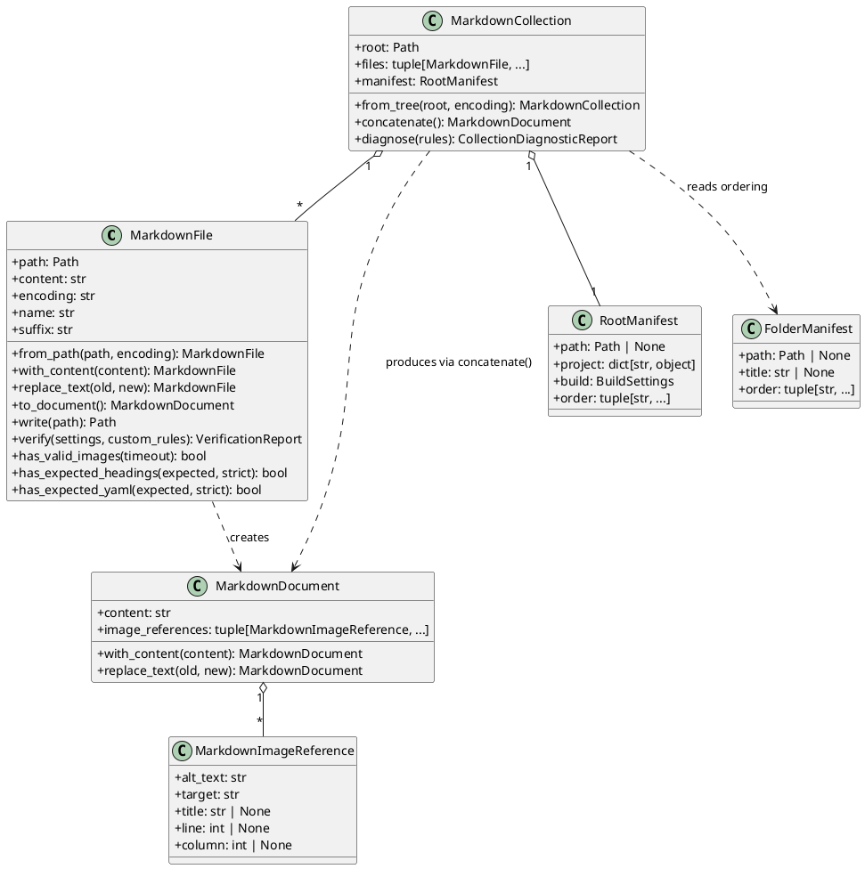

# Domain model

`MarkdownFile` owns a path and decoded source. `MarkdownDocument` owns only
in-memory content and extracted image references. `MarkdownCollection` owns an
ordered tuple of files, its root, and the root manifest.



## Why this design

Every domain object here is an immutable, frozen dataclass. Methods that
appear to "change" an object — `with_content()`, `replace_text()` — return a
new instance rather than mutating in place. This is a deliberate prototype
style: pipeline code and tests never have to worry about a shared object
being mutated behind their back, and equality comparisons in tests are
straightforward value comparisons rather than identity checks.

The split between `MarkdownFile` and `MarkdownDocument` follows a single
responsibility line: `MarkdownFile` is a *disk* concept (it owns a `path` and
knows how to read/write itself and call into `mkforge` for verification).
`MarkdownDocument` is a pure *in-memory* concept — it has no path and cannot
perform I/O. `MarkdownCollection.concatenate()` produces a `MarkdownDocument`,
never a `MarkdownFile`, because the assembled result has no single file on
disk to be associated with until the assembly pipeline decides where to write
it (see [Assembly pipeline](assembly-pipeline.md)).

`MarkdownImageReference` is intentionally *not* a resolved filesystem
reference: it only records what was written in the Markdown source (`target`,
`alt_text`, optional `title`, and its `line`/`column` position). Resolving a
target to an actual path — and deciding whether it is local or external — is
the job of the diagnostics rules and the image collector, not of the
reference object itself. This keeps `MarkdownImageReference` reusable in
contexts that never touch the filesystem.

## Manifests

`RootManifest` and `FolderManifest` are Pydantic models, not domain
dataclasses, because manifest data comes from untrusted YAML input and needs
validation at the boundary. `RootManifest` is the only manifest kind that
carries `project` metadata and `build` settings (a nested `BuildSettings`
model); `FolderManifest` is deliberately narrower and only controls `title`
and the direct-child `order` of one folder. `MarkdownCollection.from_tree()`
loads the root manifest once and lets each folder look up its own
`FolderManifest` while walking the tree.

| Object | Owns | Does not own |
|---|---|---|
| `MarkdownFile` | `path`, `content`, `encoding` | image/link resolution, validation state |
| `MarkdownDocument` | `content`, derived `image_references` | a filesystem path |
| `MarkdownImageReference` | raw `target`/`alt_text`/`title`/position | whether the target resolves or is local |
| `MarkdownCollection` | ordered `files`, `root`, `manifest` | pipeline transforms, rendering |
| `RootManifest` | `project`, `build`, top-level `order` | folder titles below the root |
| `FolderManifest` | `title`, local `order` | anything outside its own folder |

## Example

```python
from pathlib import Path
from scribpy.core.markdown_file import MarkdownFile
from scribpy.core.markdown_collection import MarkdownCollection

# A single file, loaded from disk and inspected in memory.
markdown_file = MarkdownFile.from_path("intro.md")
document = markdown_file.to_document()
for image in document.image_references:
    print(image.target, image.line)

# A whole tree of files, ordered by scribpy.yml manifests.
collection = MarkdownCollection.from_tree(Path("docs-source"))
assembled = collection.concatenate()  # raises InvalidMarkdownError on blocking diagnostics
print(assembled.content[:80])
```

`MarkdownCollection.concatenate()` builds one normalized `MarkdownDocument`:
a single H1 derived from `project.title` (or the root folder name), one
intermediate heading per traversed folder, and each file's own headings
shifted down by `heading_normalizer.normalize_markdown_headings()`. It first
runs `diagnose()` with the default rule set (see
[Diagnostic engine](diagnostics.md)) and raises `InvalidMarkdownError` if any
rule reports an `ERROR`-severity finding, so a broken collection never
reaches the assembly pipeline in the first place.
