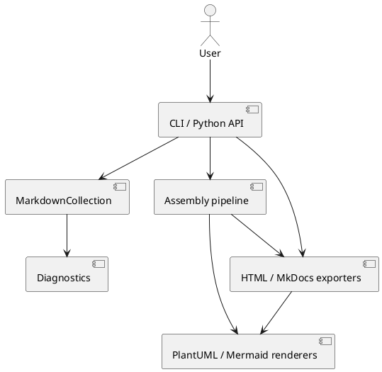

# Architecture overview

Scribpy keeps filesystem concerns, in-memory Markdown, assembly transforms,
rendering strategies, and validation reports separate. Public workflows use
small, immutable domain objects — `MarkdownFile`, `MarkdownDocument`,
`MarkdownCollection` — while adapters handle everything that talks to the
outside world: the CLI (Click), console output (Rich), diagram rendering
over HTTP or a subprocess, and filesystem I/O. No domain object performs
network calls or shells out; that responsibility lives entirely in the
renderer backends described in [Diagram renderers](diagram-renderers.md).

The system has one entry point per capability rather than one large
orchestrator: `MarkdownCollection.from_tree()` loads a project,
`MarkdownCollection.diagnose()` validates it, `concatenate()` assembles it
into one Markdown file, and `mkdocs_export()` exports it into a browsable
MkDocs site. Each of these composes the same underlying domain objects
differently, instead of duplicating logic.

## How to read this section

- [Domain model](domain-model.md) — the immutable objects that represent a
  Markdown file, an in-memory document, and a collection loaded from a
  directory tree, plus how `scribpy.yml` manifests configure them.
- [Assembly pipeline](assembly-pipeline.md) — how a `MarkdownCollection`
  becomes one assembled Markdown file, step by step, through a fixed
  sequence of pure transforms.
- [Diagram renderers](diagram-renderers.md) — the Strategy + Registry
  architecture shared by the PlantUML and Mermaid backends, and how a
  backend is selected from `scribpy.yml`.
- [Diagnostic engine](diagnostics.md) — the rule-based validation that runs
  before assembly and can block it, and the eight default rules it ships
  with.

The pages in this section adapt the source-of-truth diagrams from
`doc/architecture-core.md` into smaller, English views; when in doubt about a
class name or behavior, the source modules under `src/scribpy/core/` are
authoritative.

