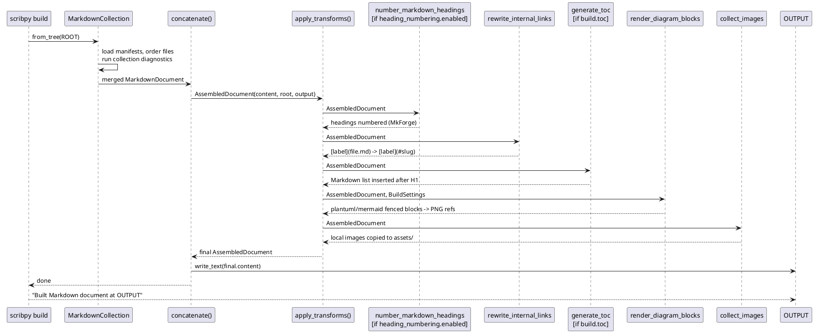
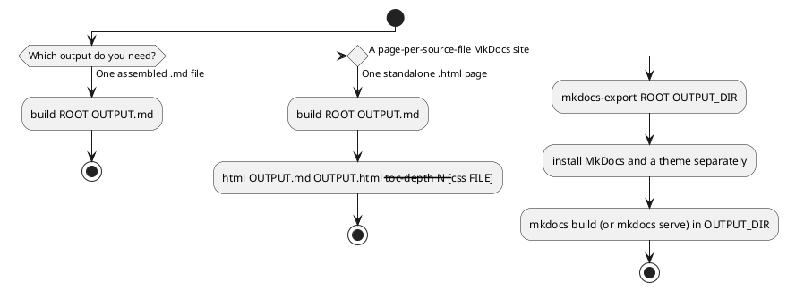

# Building and exporting

Run exports only after `scribpy validate PROJECT` succeeds. This avoids a
partial publishing workflow and gives better source locations for mistakes.

## Assemble one Markdown document

```shell
mkdir -p build
scribpy build handbook build/handbook.md
```

```text
Built Markdown document at build/handbook.md
```

`build` has two positional arguments and no command-specific options:

| Argument | Meaning |
|---|---|
| `ROOT` | Source project directory containing Markdown and manifests. |
| `OUTPUT` | Destination `.md` path. Its parent is created automatically. |

All policy — TOC, heading numbering, diagram backends — comes from the root
`scribpy.yml`. There are no CLI flags to override them per invocation.

### The assembly pipeline

`build` calls `concatenate()`, which first merges the collection into one
`MarkdownDocument` (one global H1, per-folder intermediate titles, source
headings shifted to fit) and then threads that document through up to five
transforms, applied in this fixed order:



If collection diagnostics contain any error-severity finding, concatenation
raises `InvalidMarkdownError` before any transform runs — this is why running
`validate` first avoids a half-assembled, confusing failure. The TOC step
runs after link rewriting so its anchors match the ones already written into
the body, and it reads already-numbered headings when numbering ran first
(step 1), so its slugs stay consistent with the final document.

For `build/handbook.md`, collected images are placed under `build/assets/` and
generated diagrams under `build/assets/generated/`, named after the SHA-256
hash of their source text so identical diagrams are rendered once. Keep these
directories next to the Markdown when moving or publishing it.

## Choosing between `build`, `html`, and `mkdocs-export`

All three read the same source project, but only `build` produces something
the other two can consume directly (`html`); `mkdocs-export` reads the
project source itself and never touches `build`'s output.



## Convert assembled Markdown to standalone HTML

```shell
scribpy html build/handbook.md build/handbook.html --toc-depth 3
```

```text
Exported HTML document at build/handbook.html
```

| Input | Type | Required | Default | Effect |
|---|---|---:|---|---|
| `SOURCE` | path | yes | — | Assembled Markdown, normally the output of `build`. Not a project root. |
| `OUTPUT` | path | yes | — | Standalone HTML destination. Its parent must already exist (it is not created for you). |
| `--toc-depth INTEGER` | integer | no | `3` | Navigation depth relative to H1: 1 includes H2, 2 includes H2–H3, 3 includes H2–H4. Matches `build.toc_depth` semantics from the manifest. |
| `--css FILE` | existing file | no | built-in CSS only | Existing UTF-8 stylesheet, appended verbatim after Scribpy's built-in `<style>` block so its rules can override the defaults. |

`html` strips the Markdown TOC block from the body and rebuilds it as a
burger-menu navigation panel; both the CSS and the navigation JavaScript are
inlined into the single output file, so only the HTML file itself (plus
`assets/`, since images are not inlined) needs to be published.

For example, a small override file:

```css title="handbook.css"
:root { --content-max-width: 72rem; }
body { font-family: system-ui, sans-serif; }
h1, h2 { color: #263c78; }
```

```shell
scribpy html build/handbook.md build/handbook-styled.html \
  --toc-depth 2 \
  --css handbook.css
```

The user stylesheet is appended after the built-in rules, near the end of the
`<style>` block, right before the closing `</style>` tag:

```css
/* ... Scribpy's built-in rules above ... */
:root { --content-max-width: 72rem; }
body { font-family: system-ui, sans-serif; }
h1, h2 { color: #263c78; }
</style>
```

Because it comes after the defaults in source order, any selector of equal
specificity in your file wins. Referenced image files are not converted to
data URLs, so retain `build/assets/` beside the HTML wherever you publish it.

## Export a multi-page MkDocs source tree

```shell
scribpy mkdocs-export handbook build/handbook-site
```

```text
Exported MkDocs project at build/handbook-site
```

`SOURCE` is the Scribpy project root; `OUTPUT` is a new MkDocs project
directory. For the handbook example used throughout this section, the
command writes:

```text
build/handbook-site/
├── docs/
│   ├── architecture/
│   │   ├── decisions.md
│   │   └── overview.md
│   ├── assets/
│   │   ├── generated/
│   │   │   └── <diagram-hash>.png
│   │   └── logo.png
│   ├── getting-started/
│   │   ├── daily-workflow.md
│   │   └── setup.md
│   └── index.md
└── mkdocs.yml
```

`mkdocs.yml` is a plain `site_name` / `docs_dir` / `nav` document, with `nav`
built recursively from the root and folder manifests (folder titles become
nav section headers, file H1s become page titles):

```yaml title="build/handbook-site/mkdocs.yml"
site_name: Team Engineering Handbook
docs_dir: docs
nav:
- Team Engineering Handbook: index.md
- Architecture:
  - System overview: architecture/overview.md
  - Decision records: architecture/decisions.md
- Getting started:
  - Local setup: getting-started/setup.md
  - Daily workflow: getting-started/daily-workflow.md
```

Unlike `build`, this export preserves individual source files, their own H1
headings, and `.md`-to-`.md` links unrewritten (MkDocs resolves those itself
at site-build time) — headings are never shifted or numbered. It still
renders diagrams and copies local images per source file, resolving asset
paths relative to each destination file's own folder (note `../assets/...`
from a page one level below `docs/`). It refuses to run when
`OUTPUT/mkdocs.yml` already exists, raising `ScaffoldCollisionError`,
preventing accidental overwrite of a hand-edited MkDocs configuration.

Scribpy creates MkDocs input files; it does not install MkDocs, select a
theme, build the site, or deploy it. Those are separate downstream steps —
typically `pip install mkdocs mkdocs-material` followed by `mkdocs build` or
`mkdocs serve` from inside `OUTPUT`.

