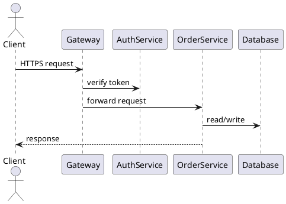

# Complete CLI tutorial

This tutorial builds a small "Team Engineering Handbook" from nothing to a
published multi-format output: an entry page, a two-page architecture
section with a PlantUML diagram, and a two-page getting-started section. You
will scaffold the project, validate it, assemble a single Markdown document,
export standalone HTML, and export a page-per-file MkDocs source tree. A
troubleshooting aside near the end shows exactly what a broken internal link
looks like and how to fix it.

Run the commands from an empty scratch directory. Every command, option, and
message shown here was run against the real CLI while writing this page.

## 1. Create the skeleton

```shell
scribpy new handbook \
  --title "Team Engineering Handbook" \
  --author "Platform Team" \
  --project-version "1.0.0"
```

```text
Created Scribpy project at handbook
```

This writes a minimal project:

```text
handbook/
├── index.md
└── scribpy.yml
```

```markdown title="handbook/index.md"
# Team Engineering Handbook
```

```yaml title="handbook/scribpy.yml"
project:
  title: Team Engineering Handbook
  author: Platform Team
  version: 1.0.0
build:
  toc: false
  heading_numbering:
    enabled: false
order:
  - index.md
```

`new` disables TOC and heading numbering by default. We will turn both on
once the manifest also needs to declare the new folders (step 3).

## 2. Add the content

Create the directories for the two sections, plus a folder for the project
logo:

```shell
mkdir -p handbook/architecture handbook/getting-started handbook/assets build
```

### Home page

Replace `handbook/index.md`:

```markdown title="handbook/index.md"
# Team Engineering Handbook

Welcome to the engineering handbook. This is the single entry point for how
our team designs, builds, and ships software.


Read the [system architecture](architecture/overview.md) first, then follow
[getting started](getting-started/setup.md) to configure your machine.
```

Internal links are always written relative to the *linking file*, not the
project root — `index.md` sits at the project root, so `architecture/overview.md`
is correct here.

### Architecture section

````markdown title="handbook/architecture/overview.md"
# System overview

Our platform is a small set of cooperating services behind a single gateway.



See [decision records](decisions.md) for why the gateway is a separate
service from authentication.
````

From `architecture/overview.md`, the sibling page is just `decisions.md` —
no `architecture/` prefix, because the link is already relative to the
`architecture/` folder.

```markdown title="handbook/architecture/decisions.md"
# Decision records

We keep architecture decisions short and dated.

- 2024-02-01 — split authentication into its own service.
- 2024-05-14 — adopted a single API gateway for rate limiting and logging.

Return to the [system overview](overview.md) for the current component
diagram.
```

### Getting-started section

```markdown title="handbook/getting-started/setup.md"
# Local setup

Follow these steps to run the platform locally.

Steps:

- Clone the repository.
- Install dependencies with the project's package manager.
- Copy the example environment file and fill in local secrets.
- Start the services with the provided compose file.

Once running, continue with [daily workflow](daily-workflow.md).
```

```markdown title="handbook/getting-started/daily-workflow.md"
# Daily workflow

Validate your changes before opening a pull request.

Run the test suite, run the linter, then push your branch. Reviewers expect
green checks before they look at a pull request.
```

### Logo image

Place a real PNG, JPEG, GIF, SVG, or other browser-usable image at
`handbook/assets/logo.png`. Do not add a Markdown title attribute to the
image reference (``) — Scribpy's
image collector does not strip a trailing quoted title from the target
before resolving the file on disk, so a titled reference is silently left
unrewritten and the file is never copied to `assets/`. Use the plain form
shown above.

## 3. Declare structure and build policy

Replace `handbook/scribpy.yml` to list the new folders and turn on TOC and
heading numbering, and set the diagram backends explicitly (these match the
built-in defaults, but are shown for clarity):

```yaml title="handbook/scribpy.yml"
project:
  title: Team Engineering Handbook
  author: Platform Team
  version: 1.0.0
build:
  toc: true
  toc_depth: 3
  heading_numbering:
    enabled: true
  plantuml_backend: plantuml_server
  plantuml_server_url: https://www.plantuml.com/plantuml
  mermaid_backend: kroki
  mermaid_command: mmdc
order:
  - index.md
  - architecture/
  - getting-started/
  - assets/
```

Create the two folder manifests:

```yaml title="handbook/architecture/scribpy.yml"
title: Architecture
order:
  - overview.md
  - decisions.md
```

```yaml title="handbook/getting-started/scribpy.yml"
title: Getting started
order:
  - setup.md
  - daily-workflow.md
```

The trailing slash in `architecture/` is optional in the root `order` list.
Every `order` entry must be a direct child of the manifest that declares it —
`handbook/scribpy.yml` cannot list `architecture/overview.md` directly.
Files that exist on disk but are omitted from an `order` list are warned
about (`ScribpyManifestWarning`) and skipped, not included by accident.

## 4. Validate before building

```shell
scribpy validate handbook
```

```text
✓ Project validation — 3 manifest(s), 5 Markdown file(s)
Project valid: True
```

For the narrower Scribpy-specific source rules only, run:

```shell
scribpy diagnose handbook
```

```text
No collection diagnostics.
```

Do not continue past this step if either command exits with status 1. See
[validation and diagnostics](validation.md) for the full list of diagnostic
codes and fixes.

## 5. Build the single Markdown document

```shell
scribpy build handbook build/handbook.md
```

```text
Built Markdown document at build/handbook.md
```

Inspect the result and its assets:

```text
build/
├── assets/
│   ├── generated/
│   │   └── af86bc12fa484f7018ebe1f1a213bc79fe2c4a639d68ff930ddd0cb8c27f8cca.png
│   └── logo.png
└── handbook.md
```

The diagram file is named after the SHA-256 hash of its PlantUML source, so
rendering the same diagram again anywhere in the project reuses the same
file instead of duplicating it. The assembled document itself:

```markdown title="build/handbook.md"
# Team Engineering Handbook

- [1. Team Engineering Handbook](#1-team-engineering-handbook)
- [2. Architecture](#2-architecture)
  - [2.1. System overview](#21-system-overview)
  - [2.2. Decision records](#22-decision-records)
- [3. Getting started](#3-getting-started)
  - [3.1. Local setup](#31-local-setup)
  - [3.2. Daily workflow](#32-daily-workflow)

## 1. Team Engineering Handbook

Welcome to the engineering handbook. This is the single entry point for how
our team designs, builds, and ships software.


Read the [system architecture](#21-system-overview) first, then follow
[getting started](#31-local-setup) to configure your machine.

## 2. Architecture

### 2.1. System overview

Our platform is a small set of cooperating services behind a single gateway.


See [decision records](#22-decision-records) for why the gateway is a
separate service from authentication.

### 2.2. Decision records
...
```

Notice everything the pipeline changed relative to the source files:

- One project-level H1 (`# Team Engineering Handbook`) replaces the separate
  H1s of `index.md`, `architecture/overview.md`, and so on — each source H1
  becomes an H2 or deeper, shifted according to its folder depth.
- Headings are numbered (`1.`, `2.`, `2.1.`, …) because
  `build.heading_numbering.enabled: true`.
- A Markdown-list TOC was inserted right after the H1, generated from the
  final numbered headings up to `toc_depth: 3` (H2 through H4).
- `[system architecture](architecture/overview.md)` became
  `[system architecture](#21-system-overview)` — an anchor into the same
  document, using the numbered-heading slug.
- The PlantUML fenced block became ``,
  rendered through the PlantUML Server backend.
- `assets/logo.png` was copied to `build/assets/logo.png` and its Markdown
  reference left pointing at the (now real) `assets/logo.png` relative path.

## 6. Build standalone HTML

```shell
scribpy html build/handbook.md build/handbook.html --toc-depth 3
```

```text
Exported HTML document at build/handbook.html
```

Open `build/handbook.html` with `build/assets/` still present next to it —
images are referenced, not inlined. The page embeds its own CSS and a
burger-menu navigation script built from the document's headings, so the
single `.html` file (plus `assets/`) is enough to share or host.

To customize the page, pass an existing stylesheet:

```css title="handbook.css"
:root { --content-max-width: 72rem; }
body { font-family: system-ui, sans-serif; }
h1, h2 { color: #263c78; }
```

```shell
scribpy html build/handbook.md build/handbook-styled.html \
  --toc-depth 2 \
  --css handbook.css
```

```text
Exported HTML document at build/handbook-styled.html
```

Your rules are appended after Scribpy's built-in CSS, so they win on equal
selector specificity. See [building and exporting](build-export.md) for more
on `--toc-depth` and `--css`.

## 7. Export the multi-page version

```shell
scribpy mkdocs-export handbook build/handbook-site
```

```text
Exported MkDocs project at build/handbook-site
```

This keeps every source file as its own page, under its original path:

```text
build/handbook-site/
├── docs/
│   ├── architecture/
│   │   ├── decisions.md
│   │   └── overview.md
│   ├── assets/
│   │   ├── generated/
│   │   │   └── af86bc12fa484f7018ebe1f1a213bc79fe2c4a639d68ff930ddd0cb8c27f8cca.png
│   │   └── logo.png
│   ├── getting-started/
│   │   ├── daily-workflow.md
│   │   └── setup.md
│   └── index.md
└── mkdocs.yml
```

The generated `mkdocs.yml` mirrors the manifest structure directly:

```yaml title="build/handbook-site/mkdocs.yml"
site_name: Team Engineering Handbook
docs_dir: docs
nav:
- Team Engineering Handbook: index.md
- Architecture:
  - System overview: architecture/overview.md
  - Decision records: architecture/decisions.md
- Getting started:
  - Local setup: getting-started/setup.md
  - Daily workflow: getting-started/daily-workflow.md
```

Unlike `build/handbook.md`, `docs/architecture/overview.md` keeps its own H1
(`# System overview`, not shifted or numbered) and its `.md` link to
`decisions.md` unrewritten — MkDocs resolves page-to-page links itself.
Image paths are adjusted relative to each file's own folder instead:
`docs/architecture/overview.md` references its diagram as
`../assets/generated/<hash>.png`, one level up from `architecture/`.

## Troubleshooting aside: a broken internal link

Suppose you rename `daily-workflow.md` in your head before actually
creating a page for it, and add a forward-looking link that points nowhere
yet:

```markdown title="handbook/getting-started/daily-workflow.md"
# Daily workflow

Validate your changes before opening a pull request.

Run the test suite, run the linter, then push your branch. Reviewers expect
green checks before they look at a pull request.

See the [release checklist](release-checklist.md) before shipping.
```

Running validation now reports the mistake before it ever reaches `build`:

```shell
scribpy validate handbook
```

```text
✗ Project validation — 3 manifest(s), 5 Markdown file(s)
 Level  Code                            Location                                Message
 ERROR  MKF001                          getting-started/daily-workflow.md:8:29  Referenced local resource does not
                                                                                exist: release-checklist.md
 ERROR  INTERNAL_MARKDOWN_LINK_MISSING  getting-started/daily-workflow.md:8     Internal Markdown link target does not
                                                                                exist: 'release-checklist.md'.
Project valid: False
```

The narrower `diagnose` reports the same underlying problem, one line:

```shell
scribpy diagnose handbook
```

```text
ERROR INTERNAL_MARKDOWN_LINK_MISSING handbook/getting-started/daily-workflow.md:8: Internal Markdown link target does not exist: 'release-checklist.md'.
```

Both point at line 8 of the real source file — not at any assembled output,
which does not exist yet because `build` never ran. The fix is either to
create `handbook/getting-started/release-checklist.md`, or to remove the
link until that page exists. Removing the link and re-running `validate`
returns to a clean report:

```text
✓ Project validation — 3 manifest(s), 5 Markdown file(s)
Project valid: True
```

## 8. Repeat safely

`build` and `html` overwrite their output files on every run — rerunning
step 5 or step 6 after editing a source page is always safe.
`mkdocs-export` deliberately does not overwrite an existing MkDocs
configuration (`ScaffoldCollisionError` if `OUTPUT/mkdocs.yml` already
exists). Use a new output directory, archive the old one, or remove it
yourself only after confirming it is disposable.

## What you just learned

- `new` creates a two-file skeleton; `scaffold` can generate the same shape
  in bulk from a headings-only outline (see
  [creating a project](project-creation.md)).
- Internal Markdown links and image targets are always relative to the file
  that contains them, not the project root.
- `scribpy.yml` files only declare the *direct* children of the folder they
  live in; nested structure is expressed by nesting manifests, not by
  writing deep paths in one `order` list.
- `validate` is the full pre-publication gate (manifests + MkForge + Scribpy
  collection rules); `diagnose` is a faster, narrower collection-only check.
  Both exit 1 on any error-severity finding.
- `build` assembles one Markdown file: it merges, numbers headings, rewrites
  `.md` links to anchors, inserts a TOC, renders diagrams, and collects
  images — always in that order.
- `html` converts one already-assembled Markdown file into a single
  self-contained HTML page; it does not read a project.
- `mkdocs-export` reads the project directly and keeps every source file as
  its own page, for use as MkDocs input — it does not build or serve a site
  itself.
- A diagnostic's location always points at the original source file and
  line, so fixes are made once, upstream, and every export benefits.
