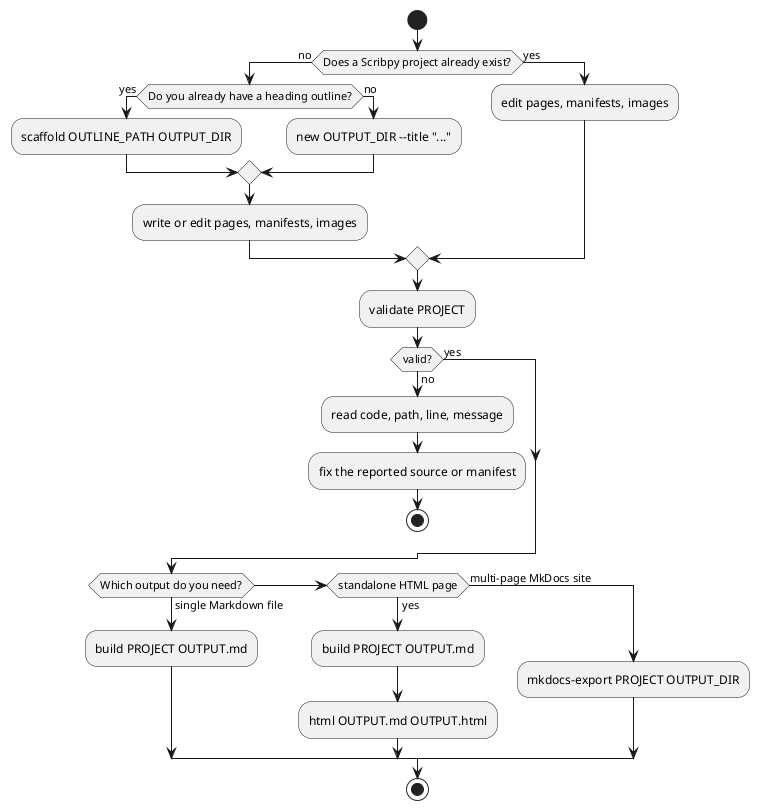
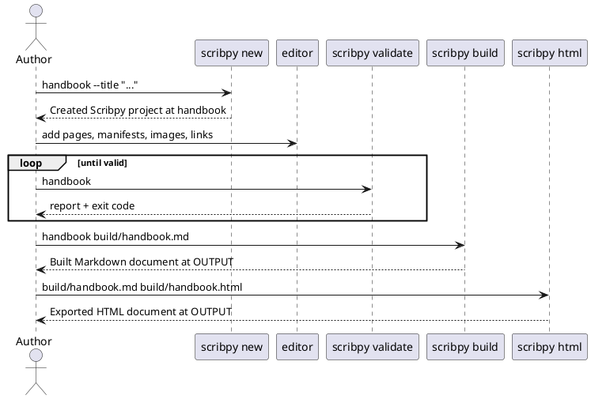

# CLI workflow

This guide builds the same small handbook from start to finish. You will create
a project, add ordered pages and an image, validate it, assemble one Markdown
document, export standalone HTML, and export a multi-page MkDocs project.

## Before you start

Install Scribpy in the environment from which you will run the commands. From
a checkout of this repository:

```shell
uv sync
uv run scribpy --version
uv run scribpy --help
```

If Scribpy is installed as a normal command, omit `uv run` in every example:

```shell
scribpy --version
```

All paths are interpreted relative to the current directory unless you pass an
absolute path. Scribpy does not change the working directory for you.

## Choose the output you need

| Goal | Commands | Result |
|---|---|---|
| One Markdown document | `validate`, then `build` | One `.md` plus collected assets. |
| One self-contained web page | `build`, then `html` | One `.html` with inline CSS and JavaScript. |
| A multi-page documentation source | `mkdocs-export` | `mkdocs.yml`, pages, and assets ready for MkDocs. |
| Check without publishing | `validate` or `diagnose` | A report and a meaningful process exit code. |

`html` does not assemble a project: it converts the Markdown produced by
`build`. Conversely, `mkdocs-export` reads the source project directly and
preserves separate pages.

### Which command do I run?

Start from what you have and what you want to produce. The decision only
depends on two things: whether a Scribpy project already exists, and which
output format you need next.



### A typical session

The commands below are almost always run in this order during active
authoring: scaffold once, then repeat edit/validate/build as content changes.



### Exit codes

Every command uses the same exit code convention, so shell automation can
branch on a single check.

| Exit code | When it happens | Commands |
|---|---|---|
| `0` | Success. For `validate`/`diagnose`, no blocking (error-severity) finding exists. | All seven commands. |
| `1` | Blocking findings exist in the report. | `validate`, `diagnose` |
| `1` | A domain or filesystem failure was translated to a `click.ClickException` (for example: `ScaffoldCollisionError`, `InvalidScribpyManifestError`, `InvalidMarkdownError`, a renderer error, or an `OSError`). Click prints `Error: <message>` and exits 1. | `new`, `scaffold`, `build`, `html`, `mkdocs-export`, and manifest/filesystem failures inside `diagnose` |

`validate` and `diagnose` never raise a `ClickException` for a normal
diagnostic finding — they print the report and exit 1 directly. A
`ClickException` on `diagnose` means loading the project itself failed
(invalid manifest, unreadable file, bad encoding), before any rule could run.

Continue with the [complete CLI tutorial](demo.md), or read the command pages
when you need one operation only.

