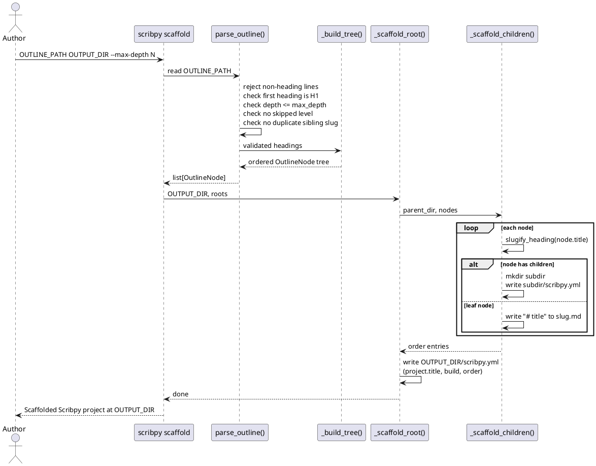

# Creating a project from the CLI

Scribpy offers two starting points. Use `new` for a minimal project that you
will shape manually. Use `scaffold` when you already know the document outline.

## Start with `new`

```shell
scribpy new handbook \
  --title "Team Handbook" \
  --author "Ada Lovelace" \
  --project-version "1.0.0"
```

The command creates `handbook/` if needed and writes:

```text
handbook/
├── index.md
└── scribpy.yml
```

`index.md` contains only the title as an H1:

```markdown title="handbook/index.md"
# Team Handbook
```

The generated `scribpy.yml` disables TOC and heading numbering by default,
so a fresh project builds byte-for-byte from its source until you opt in:

```yaml title="handbook/scribpy.yml"
project:
  title: Team Handbook
  version: 1.0.0
  author: Ada Lovelace
build:
  toc: false
  heading_numbering:
    enabled: false
order:
  - index.md
```

Options are explicit values, not project-wide defaults:

| Input | Type | Required | Default | Effect |
|---|---|---:|---|---|
| `OUTPUT_DIR` | path | yes | — | Directory that receives the project. Need not exist; unrelated existing contents are left untouched. |
| `--title TEXT` | text | yes | — | Root manifest title (`project.title`) and initial `index.md` H1. |
| `--author TEXT` | text | no | empty string | Written to `project.author`; the key is omitted entirely from the manifest when empty. |
| `--project-version TEXT` | text | no | `0.1.0` | `project.version` metadata. This is not Scribpy's own package version. |

`new` refuses to overwrite an existing project: if `OUTPUT_DIR/scribpy.yml`
already exists, it raises `ScaffoldCollisionError`, which the CLI reports as:

```text
Error: A scribpy project already exists at: OUTPUT_DIR/scribpy.yml
```

For example, running `new` a second time against the same directory:

```shell
scribpy new handbook --title "Duplicate"
```

```text
Error: A scribpy project already exists at: handbook/scribpy.yml
```

`new` may still write into an existing directory as long as that directory
has no `scribpy.yml` yet — useful when `OUTPUT_DIR` already holds unrelated
files.

## Start from an outline with `scaffold`

`scaffold` reads a headings-only Markdown outline, validates its structure,
and turns each heading into either a stub `.md` file (a heading with no
children) or a subdirectory with its own `scribpy.yml` (a heading with
children). The outline never contains prose — only ATX headings (`#`
through the selected `--max-depth`) and blank lines.



### Worked example

Create an outline with a root title and two nested sections:

```markdown title="outline.md"
# Team Engineering Handbook

## Welcome

## Architecture

### Overview

### Decisions

## Getting started

### Setup

### Daily workflow
```

Then generate the project:

```shell
scribpy scaffold outline.md handbook --max-depth 4
```

```text
Scaffolded Scribpy project at handbook
```

This produces one leaf `.md` stub per childless heading, and one
subdirectory with its own `scribpy.yml` per heading that has children:

```text
handbook/
├── architecture/
│   ├── decisions.md
│   ├── overview.md
│   └── scribpy.yml
├── getting-started/
│   ├── daily-workflow.md
│   ├── scribpy.yml
│   └── setup.md
├── index.md
├── scribpy.yml
└── welcome.md
```

The root manifest carries the outline's H1 as `project.title` and lists the
direct children in outline order. TOC and heading numbering are disabled, the
same defaults `new` uses:

```yaml title="handbook/scribpy.yml"
project:
  title: Team Engineering Handbook
build:
  toc: false
  heading_numbering:
    enabled: false
order:
  - welcome.md
  - architecture
  - getting-started
```

Each generated subdirectory manifest carries only its own title and the
order of its direct children:

```yaml title="handbook/architecture/scribpy.yml"
title: Architecture
order:
  - overview.md
  - decisions.md
```

Every stub file contains only its heading as an H1, ready to be filled in:

```markdown title="handbook/welcome.md"
# Welcome
```

### Options and validation errors

| Input | Type | Required | Default | Effect |
|---|---|---:|---|---|
| `OUTLINE_PATH` | existing file | yes | — | Outline source; Click checks the path exists and is a file before Scribpy runs. |
| `OUTPUT_DIR` | path | yes | — | Generated project root. Need not exist. |
| `--max-depth INTEGER` | integer, 1–6 | no | `4` | Deepest ATX heading level accepted from the outline. |

`scaffold` refuses to run, with the exit code and message shown, in each of
these cases:

| Condition | Raised as | Example message |
|---|---|---|
| `OUTPUT_DIR/scribpy.yml` already exists | `ScaffoldCollisionError` | `Error: A scribpy project already exists at: handbook/scribpy.yml` |
| `--max-depth` outside 1–6 | `ValueError` | `Error: max_depth must be between 1 and 6, got 8` |
| First heading is not H1 | `OutlineValidationError` | `Error: (1, 'first heading must be H1, got H2')` |
| A heading skips a level (H1 directly to H3) | `OutlineValidationError` | `Error: (3, 'heading level skipped: H1 -> H3')` |
| A heading exceeds `--max-depth` | `OutlineValidationError` | `Error: (N, 'heading depth H5 exceeds max_depth=4')` |
| The outline contains non-heading text | `OutlineValidationError` | `Error: (3, "outline must contain only ATX headings, got: 'Some prose text here.'")` |
| A heading title is empty (`##` with nothing after it) | `OutlineValidationError` | `Error: (N, 'heading title must not be empty')` |
| Two sibling headings slugify to the same name | `OutlineValidationError` | `Error: (N, "duplicate sibling slug 'overview' (title: 'Overview')")` |

`OutlineValidationError` messages surface through Click as the exception's
raw `(line_number, detail)` arguments rather than a single formatted
sentence — the line number always refers to the outline file, not the
generated project. Like `new`, `scaffold` never replaces an existing root
manifest.

