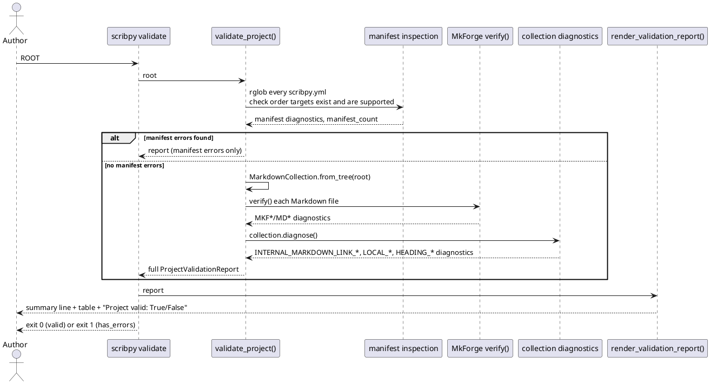
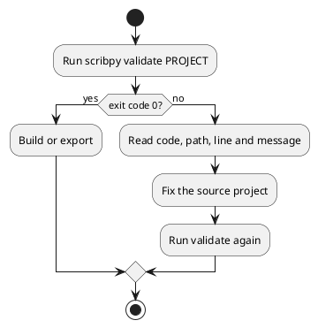

# Validation and diagnostics

Validation is a normal build step, not only a troubleshooting command. Run it
after changing a manifest, moving a page, adding a link, or adding an image.

## Full project validation

```shell
scribpy validate handbook
```

`ROOT` is the only argument. There are no command-specific options. The
command runs three checks in sequence — manifest inspection, MkForge
Markdown verification, and collection diagnostics — and renders one Rich
report combining all of them:



Manifest inspection runs first and short-circuits: if any `scribpy.yml` is
invalid or declares an `order` entry that is missing, duplicated, or not
Markdown/a directory, the report stops there — Markdown and collection
checks never run against an inconsistently declared tree.

### Example: a clean project

```text
✓ Project validation — 3 manifest(s), 5 Markdown file(s)
Project valid: True
```

The leading marker, manifest count, and Markdown count come from
`ProjectValidationReport`; no diagnostic table is printed when there are no
findings at all.

### Example: a project with errors

When findings exist, a Rich table lists every diagnostic with its severity,
stable code, project-relative location, and message — rendered here as plain
text:

```text
✗ Project validation — 3 manifest(s), 5 Markdown file(s)
 Level  Code                            Location                                Message
 ERROR  MKF001                          getting-started/daily-workflow.md:8:29  Referenced local resource does not
                                                                                exist: release-checklist.md
 ERROR  INTERNAL_MARKDOWN_LINK_MISSING  getting-started/daily-workflow.md:8     Internal Markdown link target does not
                                                                                exist: 'release-checklist.md'.
Project valid: False
```

Notice the same broken link is reported twice, by two independent checks:
`MKF001` comes from MkForge's own Markdown verification, and
`INTERNAL_MARKDOWN_LINK_MISSING` comes from Scribpy's collection diagnostics.
They agree because both resolve the link the same way; fixing the link
clears both rows.

Use the exit status in shell automation:

```shell
if scribpy validate handbook; then
  scribpy build handbook build/handbook.md
else
  echo "Build skipped: fix validation errors first" >&2
  exit 1
fi
```

## Collection-only diagnostics

```shell
scribpy diagnose handbook
```

`diagnose` loads the ordered collection and runs only the eight default
Scribpy collection rules — it never inspects manifests separately and never
calls MkForge's Markdown verification. It prints `No collection
diagnostics.` when empty, or one summary line per finding otherwise:

```text
ERROR INTERNAL_MARKDOWN_LINK_MISSING handbook/getting-started/daily-workflow.md:8: Internal Markdown link target does not exist: 'release-checklist.md'.
```

It is useful for a quick source-structure check, but `validate` is the
broader pre-publication gate.

### `validate` vs `diagnose`

| | `validate` | `diagnose` |
|---|---|---|
| Scope | Whole project: manifests, MkForge Markdown rules, collection rules | Collection rules only |
| Manifest `order` checks | Yes (missing/duplicate/unsupported entries) | No |
| MkForge conformance (`MKF*`, `MD*`) | Yes | No |
| Collection rules (`SOURCE_*`, `INTERNAL_MARKDOWN_LINK_*`, `LOCAL_*`, `IMAGE_*`, `HEADING_LEVEL_OVERFLOW`) | Yes | Yes |
| Output | Rich table with level, code, location, message, plus a summary line | Plain-text summary, one line per finding |
| Empty result | `Project valid: True` with no table | `No collection diagnostics.` |
| Exit code on findings | 1 if any finding has error severity | 1 if any finding has error severity |
| Exit code on load failure | Reflected as a `PROJECT_LOAD_FAILED`/`MANIFEST_INVALID` diagnostic inside the report, still exit 1 | `ClickException`, exit 1, no report printed at all |
| Typical use | Pre-publish gate before `build`/`html`/`mkdocs-export` | Fast structural check while editing source content |

## Read a finding

A diagnostic line contains severity, stable code, location, and message:

```text
ERROR SOURCE_H1_COUNT_INVALID handbook/guide/install.md:7:
Markdown file must contain exactly one H1 heading; found 2.
```

Fix the source file and line shown. Do not edit assembled output: it will be
replaced on the next build.

## Common errors and fixes

| Code or failure | Cause | Fix |
|---|---|---|
| `SOURCE_FIRST_HEADING_NOT_H1` | First real heading is H2–H6. | Make the page title the first H1. |
| `SOURCE_H1_COUNT_INVALID` | Zero or multiple H1 headings. | Keep exactly one page-title H1. |
| `HEADING_LEVEL_OVERFLOW` | A heading becomes deeper than H6 after nesting. | Flatten folders or reduce source heading depth. |
| `INTERNAL_MARKDOWN_LINK_MISSING` | Relative `.md` target does not exist. | Correct the path relative to the source file. |
| `INTERNAL_MARKDOWN_LINK_OUTSIDE_ROOT` | Link escapes the project. | Move the target inside the project and update the link. |
| `LOCAL_ANCHOR_LINK` | Link contains `#`. | Link to the source page without a fragment. |
| `LOCAL_IMAGE_MISSING` | Local image cannot be found. | Add the file or correct the relative target. |
| `IMAGE_OUTSIDE_ROOT` | Image path escapes the project. | Store the image inside the project. |
| `EXTERNAL_IMAGE_REFERENCE` | Image uses an external URL. | Accept the warning or copy the image locally. |
| Manifest order error | Listed child is missing or unsupported. | Correct the direct-child name in the nearest manifest. |

Warnings do not make `Project valid: False`, but should be reviewed for
reproducible output.



