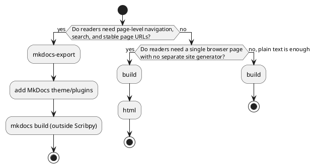

# Choosing and managing output

Scribpy supports three publication shapes. Choose based on how readers consume
the document, not only on file extension.



| Output | Command(s) | Best for |
|---|---|---|
| Assembled Markdown | `build` | Feeding another Markdown-aware tool; one-file deliverables; diffing in version control. |
| Standalone HTML | `build` then `html` | A single browser-viewable file with no server or site generator. |
| MkDocs input tree | `mkdocs-export` | Page-per-file navigation, search, and a normal static-site workflow with a theme. |

## Assembled Markdown

Use `build` when another Markdown-aware tool is downstream or when one file is
the required deliverable.

```shell
scribpy build handbook work/handbook/document.md
```

The output directory may also contain `assets/` and `assets/generated/`.
Moving only `document.md` can break images. Move or archive the complete output
directory.

Advantages:

- portable plain text;
- one searchable source;
- compatible with later converters;
- headings, links, TOC, diagrams, and images already normalized.

Trade-offs:

- source pages are no longer independently navigable;
- generated anchor names matter to downstream renderers;
- large projects produce a large file.

## Standalone HTML page

Use `html` after `build` when readers need a browser document without a site
generator.

```shell
scribpy build handbook work/handbook/document.md
scribpy html work/handbook/document.md work/handbook/document.html
```

CSS and navigation JavaScript are inline, but image assets remain files. The
HTML is therefore self-contained in behavior and styling, not necessarily a
single binary blob.

Choose `--toc-depth` for navigation size. A deep menu helps reference material
but can overwhelm short documents. Custom CSS is appended after Scribpy's base
stylesheet and can override it.

## MkDocs input tree

Use `mkdocs-export` when readers need page-level navigation, search, stable
page URLs, and a normal static-site workflow.

```shell
scribpy mkdocs-export handbook work/handbook/site-source
```

Scribpy writes input for MkDocs, not final site HTML. The generated
configuration contains `site_name`, `docs_dir`, and manifest-derived `nav`.
You may add a theme and other MkDocs settings downstream, but regenerating into
the same directory is intentionally refused when `mkdocs.yml` exists.

Advantages:

- pages and file links remain separate;
- manifest hierarchy becomes navigation;
- compatible with MkDocs themes and plugins.

Trade-offs:

- requires a separate MkDocs installation and build;
- customization of generated configuration needs an ownership strategy;
- deployment is outside Scribpy.

A minimal follow-up to actually see the site, once `mkdocs.yml` has a theme:

```shell
scribpy mkdocs-export handbook work/handbook/site-source
cd work/handbook/site-source
echo "theme:
  name: material" >> mkdocs.yml
uv run --with mkdocs-material mkdocs serve
```

Because Scribpy refuses to write into a directory that already has
`mkdocs.yml`, iterating on content means either deleting the generated
`mkdocs.yml` before re-running `mkdocs-export` (losing your theme edits) or
keeping theme/plugin configuration in a separate file merged by your own
build script. Most teams settle on regenerating into a fresh directory and
copying a hand-maintained `mkdocs.yml` header over the generated `nav:`
section.

## Reproducible output directories

Prefer a dedicated build root such as `work/`:

```text
work/handbook/
├── assembled/
│   ├── assets/
│   ├── document.html
│   └── document.md
└── mkdocs-source/
    ├── docs/
    └── mkdocs.yml
```

Do not write generated output inside the source project. That can make build
files appear as unlisted children or accidentally enter later collections.

For reproducibility, validate first, start from an empty output location, keep
the root manifest under version control, and record external renderer choices.

