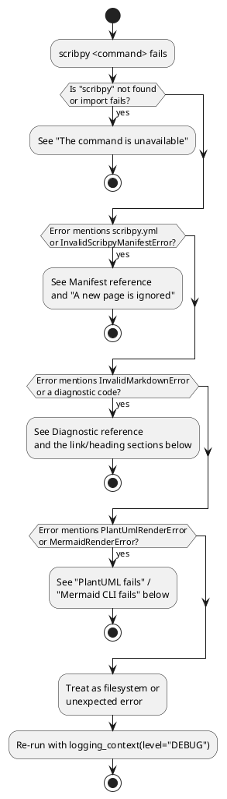

# Troubleshooting

Start by identifying which boundary failed: command discovery, manifest load,
validation, assembly, diagram rendering, filesystem output, or downstream
MkDocs.



## The command is unavailable

Run `python -c "import scribpy; print(scribpy.__version__)"`. If import fails,
install the package in the active environment. If import succeeds but the
command fails, use `python -m pip show scribpy`, activate the correct
environment, or use `uv run scribpy` from the checkout.

## The project root is rejected

`MarkdownCollection.from_tree` requires an existing directory. Check spelling
and current working directory:

```shell
pwd
ls handbook
scribpy validate ./handbook
```

An input path accepted by Click is not necessarily checked for existence until
the public API runs.

## A new page is ignored

The nearest manifest probably has a non-empty `order` that does not list it.
Add the page's direct name to that manifest. For `guide/new.md`, edit
`guide/scribpy.yml`, not the root order.

## A link works in an editor but validation fails

Resolve it from the containing page. A link in `guide/workflow.md` to root
`index.md` is `../index.md`, not `index.md`. Remove anchor fragments; Scribpy
forbids both `#section` and `page.md#section` in source collections.

## An image is missing after moving a page

Image targets move with the referencing page, not with the project root.
Recalculate the relative path and validate. Keep the image inside the project.
After building, move the entire output asset directory with the document.

## Heading overflow appears unexpectedly

Folder nesting consumes heading levels. A source H1 becomes H2 at root, H3 one
folder deep, and so on. Reduce the deepest source heading or flatten the folder
tree. Heading numbering does not solve structural overflow.

## PlantUML fails

- Confirm `plantuml_backend` spelling.
- Do not use `local`; it is unimplemented.
- Check that `plantuml_server_url` is absolute HTTP(S).
- Check DNS, proxy, TLS, service availability, and confidentiality policy.
- Catch `PlantUmlRenderError` in API applications and display its `detail`.

## Mermaid CLI fails

Run `mmdc --version` or the configured executable manually. Confirm Node,
Chromium/Puppeteer requirements, permissions, and `PATH`. Scribpy reports
missing commands, timeout, non-zero process status, and missing output as
`MermaidRenderError`.

## HTML has no images

The HTML embeds CSS and JavaScript, not image bytes. Keep `assets/` at the path
expected by the assembled Markdown/HTML. Rebuild from source instead of hand
editing generated URLs.

## MkDocs export refuses an existing directory

The precise collision is `OUTPUT/mkdocs.yml`. Scribpy protects it with
`ScaffoldCollisionError`. Select a fresh destination or deliberately archive
and remove the old generated directory before retrying. Scribpy has no force
option.

## `scribpy new` or `scaffold` refuses the target directory

The exact collision is `OUTPUT_DIR/scribpy.yml`, the same
`ScaffoldCollisionError` as MkDocs export. An otherwise-empty or
unrelated-content directory is fine; only an existing manifest blocks the
call. This is deliberate: Scribpy never silently overwrites project
configuration.

## A diagnostic error names a rule code I don't recognize

Look the code up in [Diagnostic reference](../reference/diagnostics.md#default-collection-rules)
for its trigger and remediation, or in
[Markdown sources](../notes-project/markdown-sources.md) and
[Links and images](../notes-project/links-and-images.md) for the narrative
explanation. Codes are stable identifiers meant for scripts and CI checks;
branch on `finding.code`, not on the human-readable `finding.message`.

## Outputs from different commands don't match

`build`, `html`, and `mkdocs-export` each perform their own diagram
rendering and image collection into independent `assets/` directories. A
diagram that fails to render for `build` will independently fail (or
succeed) for `mkdocs-export` on the next invocation — there is no shared
render cache between output shapes, only within a single command's run
(same-content diagrams within one build reuse one PNG). If a diagram
renders in one output but not another, compare command exit codes and
`scribpy.yml` — both commands read the same manifest, so a difference
usually means one run used a stale environment (missing `mmdc`, unreachable
PlantUML server) rather than different configuration.

## Get more evidence

Enable logging around Python workflows:

```python
with scribpy.logging_context(level="DEBUG", file=Path("scribpy.log")):
    collection = scribpy.MarkdownCollection.from_tree("handbook")
    scribpy.concatenate(collection, Path("work/document.md"))
```

For CLI behavior, reproduce with the equivalent Python call when you need
structured exceptions. Never publish logs before checking them for local paths
or sensitive diagram/service details.

