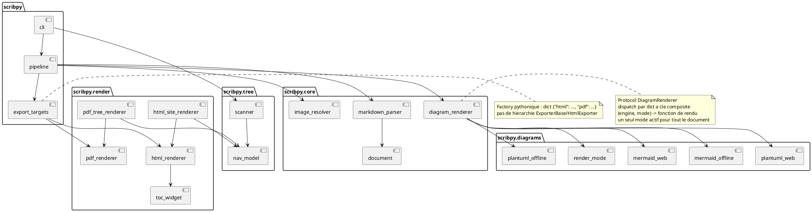

## Architecture proposée — Scribpy

**Contexte retenu** : package Python (PyPI, `uv`), bibliothèque + CLI, exécuté principalement en environnement Windows contraint (pas de droits admin, proxy avec interception SSL). Quatre fonctionnalités utilisateur (export HTML simple, export PDF simple, site HTML depuis arborescence, PDF agrégé depuis arborescence) qui partagent une même chaîne de transformation amont (parsing Markdown, résolution d'images, rendu de diagrammes, application de CSS) et diffèrent uniquement sur le format de sortie final et la portée (un fichier vs une arborescence).

**Exigences couvertes** : REQ-001 à REQ-023 (SRS du 2026-06-21).

**Pattern retenu** : Architecture en couches simples (`source` → `pipeline de transformation` → `rendu de sortie`), avec le point de variation "format de sortie" résolu par **Strategy pythonique** (callable injecté), pas par une hiérarchie de classes `Exporter`/`HtmlExporter`/`PdfExporter`. Justification : la complexité métier de Scribpy n'est pas dans des règles de domaine élaborées (pas de DDD, pas de Clean Architecture à couches concentriques) mais dans une chaîne de transformations linéaire — une structure en couches suffit, et c'est le seul point qui varie réellement (HTML vs PDF, fichier unique vs arborescence) qui justifie un point d'extension.

### Pourquoi pas Architecture hexagonale complète

Tentant vu la diversité des sorties, mais écarté : il n'y a qu'une seule vraie "porte" d'entrée (lire des fichiers Markdown sur disque) et la variation est uniquement en sortie. Une architecture ports/adapters complète ajouterait une couche d'abstraction (ports d'entrée) sans bénéfice mesurable ici — sur-ingénierie au sens du Principe 4. Le point d'extension utile est ciblé sur le rendu de sortie, pas sur toute l'architecture.

### Structure

```
scribpy/
├── pyproject.toml
├── src/
│   └── scribpy/
│       ├── __init__.py
│       ├── _version.py
│       ├── config.py                 # dataclasses figées : ScribpyConfig, CssConfig, TocConfig
│       ├── core/
│       │   ├── __init__.py
│       │   ├── document.py           # ParsedDocument, Heading, ImageRef (dataclasses gelées)
│       │   ├── markdown_parser.py    # markdown texte -> ParsedDocument (markdown-it-py)
│       │   ├── image_resolver.py     # vérifie existence des images référencées
│       │   └── diagram_renderer.py   # Protocol DiagramRenderer + dispatch moteur x mode
│       ├── diagrams/
│       │   ├── __init__.py
│       │   ├── render_mode.py        # Enum RenderMode (WEB, OFFLINE) + DiagramRenderConfig
│       │   ├── plantuml_offline.py   # wrapper plantuml.jar local (subprocess)
│       │   ├── plantuml_web.py       # appel HTTP au serveur PlantUML public
│       │   ├── mermaid_offline.py    # wrapper mmdc (pip, pas de Node.js)
│       │   └── mermaid_web.py        # appel HTTP à mermaid.ink
│       ├── tree/
│       │   ├── __init__.py
│       │   ├── scanner.py            # arborescence de .md -> structure de navigation
│       │   └── nav_model.py          # NavNode (dataclass) : page, enfants, ordre
│       ├── render/
│       │   ├── __init__.py
│       │   ├── html_renderer.py      # ParsedDocument -> HTML (page unique)
│       │   ├── html_site_renderer.py # NavNode -> arborescence HTML (utilise html_renderer)
│       │   ├── pdf_renderer.py       # ParsedDocument -> PDF (page unique, via markdown-pdf)
│       │   ├── pdf_tree_renderer.py  # NavNode -> PDF agrégé (utilise pdf_renderer)
│       │   └── toc_widget.py         # génération du menu hamburger JS (snippet HTML/JS statique)
│       ├── pipeline.py               # @step + PipelineContext, orchestration des étapes
│       ├── export_targets.py         # Strategy : {"html": ..., "pdf": ...} dict de callables
│       └── cli.py                    # argparse, point d'entrée console_scripts
└── tests/
    ├── unit/
    │   ├── test_markdown_parser.py
    │   ├── test_image_resolver.py
    │   ├── test_diagram_renderer.py
    │   ├── test_plantuml_offline.py
    │   ├── test_plantuml_web.py
    │   ├── test_mermaid_offline.py
    │   ├── test_mermaid_web.py
    │   ├── test_html_renderer.py
    │   ├── test_pdf_renderer.py
    │   └── test_tree_scanner.py
    └── integration/
        ├── test_export_html_e2e.py
        ├── test_export_pdf_e2e.py
        └── test_site_e2e.py
```

### Flux principal

**F1/F2 (page unique, HTML ou PDF)** : un chemin de fichier `.md` entre dans `pipeline.py`. Étapes successives (chacune un `@step`, fonction pure testable isolément) : `markdown_parser.parse` lit le texte et produit un `ParsedDocument` (titres, images référencées, blocs de code typés) → `image_resolver.resolve` vérifie l'existence de chaque image et lève un avertissement collecté (pas une exception bloquante, cf. REQ-018) pour les manquantes → `diagram_renderer.render_all` remplace les blocs PlantUML/Mermaid par des références SVG, en sélectionnant la fonction de rendu d'après deux axes — le moteur (`plantuml`/`mermaid`, déduit du langage du bloc) et le mode (`web`/`offline`, un seul réglage global pour tout le document, REQ-024) — avant de déléguer au module concret (`plantuml_web`, `plantuml_offline`, `mermaid_web` ou `mermaid_offline`) → le `ParsedDocument` enrichi est passé au renderer choisi (`html_renderer` ou `pdf_renderer`) qui produit la sortie finale dans le répertoire de destination fourni par l'utilisateur (REQ-007).

En mode web, un échec d'appel réseau (proxy, service indisponible) lève immédiatement `DiagramRenderError` nommant le bloc concerné et le mode actif — pas de repli automatique vers le mode hors-ligne (REQ-025), conformément à la décision explicite de fail-fast plutôt que de masquer un échec réseau par un comportement silencieux différent de celui demandé par l'utilisateur.

**F3/F4 (arborescence)** : `tree/scanner.py` parcourt un répertoire racine et produit un `NavNode` racine (structure récursive simple, pas de classe `Node` héritée — un seul type de nœud, une liste d'enfants). Pour F3 (site HTML), `html_site_renderer` parcourt l'arbre et appelle `html_renderer` pour chaque feuille, en générant en plus la navigation inter-pages. Pour F4 (PDF agrégé), `pdf_tree_renderer` parcourt l'arbre dans l'ordre déterminé (alphabétique par défaut, cf. hypothèse SRS section 4) et concatène les sections via l'API `Section` de `markdown-pdf`, qui produit nativement le sommaire/marque-pages global (REQ-011, REQ-015).

**Sélection du format de sortie** : `export_targets.py` expose un dictionnaire `{"html": render_html_target, "pdf": render_pdf_target}` — Factory pythonique simple. Le CLI ou l'appel programmatique sélectionne la fonction par clé ; ajouter un format futur (ex. `epub`) signifie ajouter une entrée au dictionnaire, jamais modifier le code existant des autres formats (REQ-020).

### Composition vs héritage

- Aucune hiérarchie de classes pour les formats de sortie : chaque renderer est une fonction (ou un petit callable configuré par dataclass), injectée via le dictionnaire `export_targets`. Pas de classe abstraite `BaseExporter`.
- `DiagramRenderer` est un `Protocol` structurel (`render(code: str) -> Path`) implémenté indépendamment par `plantuml_offline.render`, `plantuml_web.render`, `mermaid_offline.render`, `mermaid_web.render` — pas de classe mère commune, juste la même signature. Le dispatch se fait par un dictionnaire à clé composite `{(Engine.PLANTUML, RenderMode.OFFLINE): plantuml_offline.render, (Engine.PLANTUML, RenderMode.WEB): plantuml_web.render, (Engine.MERMAID, RenderMode.OFFLINE): mermaid_offline.render, (Engine.MERMAID, RenderMode.WEB): mermaid_web.render}`, cohérent avec le pattern déjà utilisé pour `export_targets`. Une clé composite `(engine, mode)` est préférée à deux dictionnaires imbriqués : elle reste un seul niveau de lookup, sans branchement conditionnel imbriqué qui augmenterait la complexité cyclomatique de la fonction de dispatch.
- Le réglage de mode (`RenderMode.WEB`/`RenderMode.OFFLINE`) est une valeur unique portée par `ScribpyConfig` (cf. `config.py`), pas un paramètre par moteur ni par bloc — conforme à REQ-024 (réglage global) et évite d'introduire une syntaxe d'override dans le Markdown source, non demandée.
- `NavNode` est une unique dataclass récursive (pas de sous-classes `FileNode`/`DirNode`) — un champ `children: list[NavNode]` vide signale une feuille ; cela évite une hiérarchie à 2 niveaux pour une distinction qui se réduit à une liste vide ou non.
- Seule exception légitime à la composition : une hiérarchie d'exceptions (`ScribpyError` → `ImageNotFoundError`, `DiagramRenderError`, `InvalidMarkdownError`) — relation est-un réelle et stable, usage classique et conforme au Principe 1. `DiagramRenderError` couvre aussi bien un échec de rendu hors-ligne (`.jar` introuvable, `mmdc` en erreur) qu'un échec réseau en mode web (REQ-025) ; le mode et le moteur concernés sont portés comme attributs de l'exception plutôt que par des sous-classes supplémentaires, pour ne pas multiplier les types pour une information qui reste de la donnée, pas une nouvelle nature d'erreur.

### Dépendances retenues

- **Stdlib** : `pathlib` (chemins, vérification d'existence d'images REQ-004), `dataclasses` (toutes les structures de configuration et de données), `typing`/`Protocol` (points d'extension), `argparse` (CLI), `shutil` (copie d'assets vers le répertoire d'export REQ-007), `subprocess` (appel du `.jar` PlantUML local en mode hors-ligne), `enum` (types de blocs de diagramme, formats de sortie, `RenderMode`).
- **Externes** :
  - `markdown-it-py` — déjà utilisé par Antoine pour le validateur Markdown ; la stdlib n'offre pas de parseur Markdown conforme CommonMark, écrire un parseur maison serait une dépense non triviale et risquée (Principe 3).
  - `markdown-pdf` (vb64) — couvre nativement REQ-009 (pip seul, sans GTK/Pango/Cairo/wkhtmltopdf), REQ-010 (CSS), REQ-011 (TOC/bookmarks) et l'intégration d'images. Écrire un générateur PDF maison serait disproportionné face à un besoin déjà couvert par une lib pip-only mature.
  - `mmdc` (MohammadRaziei) — rendu Mermaid en Python pur via PhantomJS/phasma, sans Node.js/npm/navigateur : option retenue pour le mode hors-ligne (REQ-006, REQ-024) en environnement contraint.
  - Pas de lib Python dédiée pour PlantUML hors-ligne : un wrapper `subprocess` appelant le `.jar` local déjà en possession d'Antoine (cohérent avec son usage Obsidian) couvre REQ-005 en mode hors-ligne sans dépendance pip supplémentaire — Java est un prérequis documenté, pas une nouvelle contrainte introduite par Scribpy.
  - `httpx` — requis pour le mode web (REQ-024) : appels HTTP vers le serveur PlantUML public et `mermaid.ink`. La stdlib `urllib.request` couvrirait techniquement le besoin mais resterait pénible pour la gestion de timeout explicite et la distinction claire entre erreur réseau et erreur HTTP, nécessaire pour produire l'erreur explicite exigée par REQ-025 ; `httpx` est listé par le skill d'architecture comme lib quasi-standard acceptable pour ce cas précis. Dépendance optionnelle au sens fonctionnel (seulement sollicitée si `RenderMode.WEB` est actif) mais déclarée comme dépendance ferme du package — l'isoler en extra `pip` (`scribpy[web]`) est une option à trancher en fonction du retour d'Antoine, non actée ici pour ne pas complexifier l'installation par anticipation.

### Point de tension explicite : REQ-016/REQ-017 vs REQ-024

Le mode web introduit, par construction, un appel réseau sortant vers des domaines publics (service PlantUML, `mermaid.ink`) — ce que REQ-017 interdisait initialement de façon absolue. La révision du SRS rend cette contrainte conditionnelle au mode actif. Cela signifie concrètement que, dans l'environnement contraint d'Antoine (proxy avec interception SSL), le mode web nécessite que ces domaines soient explicitement autorisés au niveau du proxy d'entreprise — point hors du contrôle de Scribpy lui-même, à documenter comme prérequis d'usage du mode web plutôt qu'à tenter de contourner techniquement (ex. pas de gestion automatique de certificat alternatif dans le code, ce qui relèverait de la configuration réseau de l'utilisateur, pas du package).

### Ce qu'on évite et pourquoi

- **Clean Architecture / DDD** : pas de règles métier complexes ni de langage ubiquitaire à modéliser — la chaîne est une transformation séquentielle de données, une structure en couches simple suffit.
- **Hiérarchie de classes Exporter/Renderer** : le point de variation (format de sortie, type de diagramme) est résolu par dictionnaire de callables (Factory pythonique) — pas de bénéfice à une hiérarchie OO pour 2-3 variantes stables.
- **Fallback automatique web → hors-ligne en cas d'échec réseau** : explicitement écarté par décision utilisateur (REQ-025) — un échec en mode web doit rester visible et explicite, pas masqué par un changement de comportement silencieux vers un mode différent de celui demandé.
- **Réglage du mode par moteur ou par bloc de diagramme** : écarté en faveur d'un réglage global unique (REQ-024) — une granularité plus fine n'a pas été demandée et ajouterait une syntaxe d'override dans le Markdown source sans bénéfice actuellement exprimé.
- **Prévisualisation live / serveur de développement** (à la `mkdocs serve`) : hors périmètre SRS section 5 — ajouter un composant serveur changerait la nature du package (processus long-running vs outil batch) sans demande explicite.

### Diagramme

Diagramme de composants (niveau C4-3) — pertinent ici car la décision de conception repose sur la granularité modules/dispatch, pas seulement sur les conteneurs.



