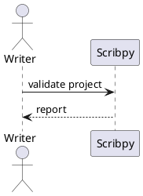
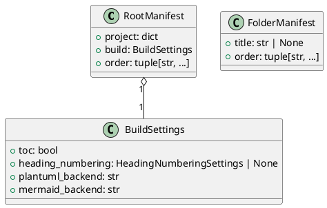
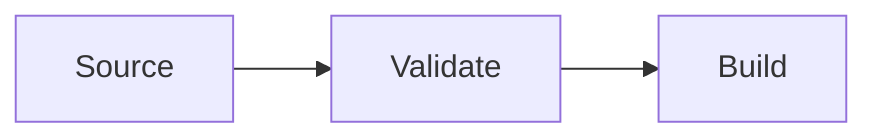
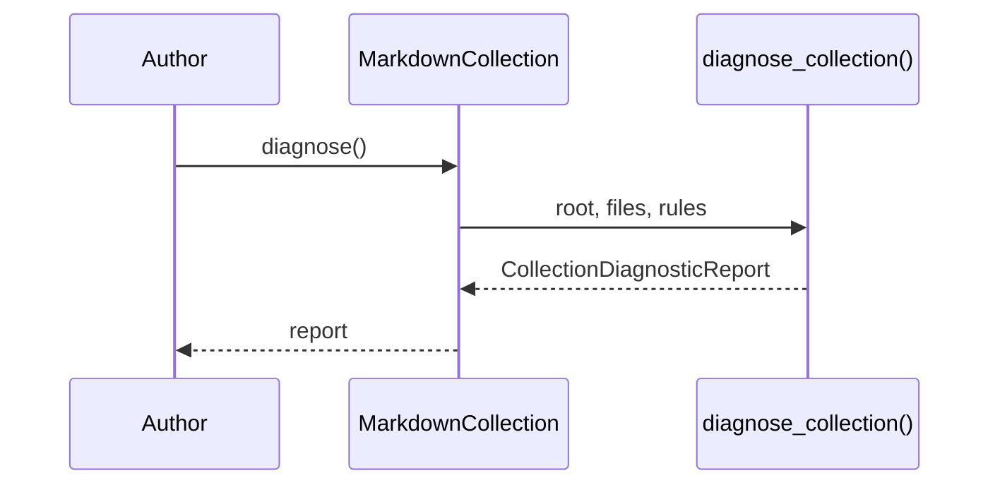

# Diagram sources

Scribpy recognizes fenced code blocks whose language is `plantuml` or
`mermaid`. Other code fences remain unchanged.

## PlantUML

````markdown

````

The default `plantuml_server` renderer sends UTF-8 diagram source to the
configured PlantUML Server URL and expects PNG bytes. Configure it at the root:

```yaml
build:
  plantuml_backend: plantuml_server
  plantuml_server_url: https://www.plantuml.com/plantuml
```

Available names:

| Name | Implementation | Network | Configuration |
|---|---|---:|---|
| `plantuml_server` | PlantUML Server HTTP adapter | yes | `plantuml_server_url` |
| `kroki` | Kroki PlantUML adapter | yes | fixed Kroki service behavior |
| `web` | Alias of `kroki` | yes | compatibility name |
| `local` | Placeholder | — | Always raises `NotImplementedError`. |

Do not select `local` expecting a local `plantuml.jar`; that code path is not
implemented.

### Worked example: a class diagram in a source page

A source page can mix explanatory prose with a diagram exactly like any other
fenced block:

````markdown
# Manifest model

Scribpy validates two manifest shapes: the root manifest and the folder
manifest, shown below.



Only the root manifest carries `build` settings.
````

During assembly, the `plantuml` fence is replaced in place by
``; the surrounding prose is
untouched.

### Why PlantUML Server is the default, not Kroki

Both backends return PNG over HTTP, but PlantUML Server is the *default*
because it is the same rendering engine most PlantUML authors already target
(the official public instance or a self-hosted one), while `kroki` remains
available explicitly for projects that already standardize on Kroki for other
diagram types. See ADR-005 for the full rationale, including why the URL is a
separate `plantuml_server_url` field rather than a new backend name per
self-hosted instance.

## Mermaid

````markdown

````

Default configuration:

```yaml
build:
  mermaid_backend: kroki
```

Local CLI configuration:

```yaml
build:
  mermaid_backend: mermaid_cli
  mermaid_command: mmdc
```

| Name | Implementation | Network | Configuration |
|---|---|---:|---|
| `kroki` | Kroki Mermaid adapter | yes | none |
| `web` | Alias of `kroki` | yes | compatibility name |
| `mermaid_cli` | Official Mermaid CLI subprocess | no rendering service | `mermaid_command` |
| `local` | Alias of `mermaid_cli` | no rendering service | `mermaid_command` |

The CLI renderer resolves the executable, uses an isolated temporary
directory, enforces execution success, and requires a PNG result. A missing
executable, timeout, non-zero exit, or absent PNG becomes
`MermaidRenderError`.

### Worked example: a sequence diagram in a source page

````markdown
# Validation flow

Running `scribpy validate` walks every diagnostic rule against the
collection before reporting.



Warnings do not block the build; errors do.
````

### Why Kroki stays the Mermaid default while CLI is optional

Unlike PlantUML, Mermaid has no official public PNG rendering API — only the
`@mermaid-js/mermaid-cli` (`mmdc`) tool, which needs Node.js and a Chromium
install and does not run reliably in every target environment. Kroki remains
the default for that reason; `mermaid_cli` is offered as an explicit opt-in
for fully offline or airgapped rendering once `mmdc` is installed separately.
See ADR-006 for the full rationale, including why the CLI is invoked with an
argument list (no shell) and an isolated temporary directory.

## Generated files

Both languages are converted to PNG during `build` and `mkdocs-export`.
Generated names are deterministic SHA-256 digests of diagram source and are
written under `assets/generated/`. The fence is replaced by a normal Markdown
image reference.

If two blocks have identical source, they can share a generated image. A small
source change creates a different name, so stale output directories may retain
older generated files; treat the whole output directory as disposable build
material.

### How deduplication actually works

`render_diagram_blocks()` computes `png_filename(diagram)` as
`sha256(diagram_source_utf8).hexdigest() + ".png"` for every matched fence,
*before* calling the renderer. It then checks whether a file with that name
already exists under `generated_dir`:

- if it exists, the renderer is **not** called again — the existing PNG is
  reused and the fence is simply replaced with a reference to it;
- if it does not exist, the renderer runs once, and the result is written to
  that path.

This means two diagrams with byte-for-byte identical source (even across
different source pages) render exactly once per build and share one PNG file.
Any change to the diagram source — including whitespace — produces a
different digest and therefore a new file; nothing is overwritten in place,
so an output directory can accumulate PNGs from diagrams that no longer exist
in any source file. Because of this, clean output directories before a
publish rather than relying on incremental cleanup.

## Security and confidentiality

Network backends transmit diagram source to an external service. Do not put
credentials, private hostnames, personal data, or confidential architecture in
a diagram sent to a public provider. Use a controlled service instance when
the backend supports its URL, or use Mermaid CLI for local Mermaid rendering.

## Troubleshooting diagrams

1. Confirm the fence language is exactly `plantuml` or `mermaid`.
2. Validate `scribpy.yml` and backend spelling.
3. For PlantUML Server, confirm an absolute HTTP(S) URL.
4. For network providers, test connectivity and service availability.
5. For Mermaid CLI, run the configured command manually and check `PATH`.
6. Read the `PlantUmlRenderError` or `MermaidRenderError` detail.
