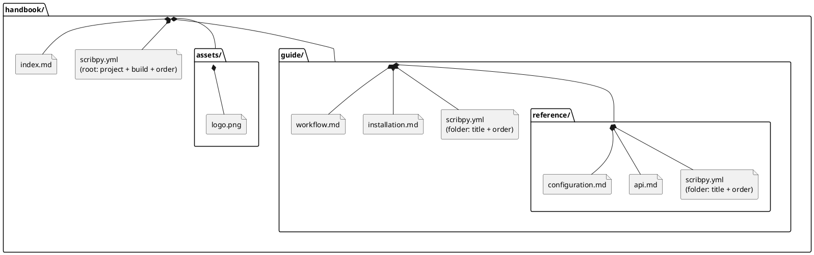

# Project structure

A Scribpy project (also called a "notes project" or "collection") is a plain
directory tree of `.md` files, optionally annotated with `scribpy.yml`
manifests. There is no database and no hidden index: everything Scribpy needs
to assemble or export the project is either a Markdown file on disk or a
manifest next to it.

Two manifest shapes exist:

- the **root manifest**, at the top of the tree, which additionally carries
  project metadata and global build settings;
- **folder manifests**, one per subdirectory, which only carry a display
  title and a child order.

## A worked example



Only `.md` and `.markdown` files and directories are treated as collection
children; `scribpy.yml` itself is never listed as a child, and any other file
type (such as `assets/logo.png` above) is invisible to traversal — it is only
reached indirectly, through image references written inside a Markdown file.

## Traversal order

For each directory, Scribpy builds the list of direct children (Markdown
files and subdirectories) and orders them one of two ways:

1. **Manifest-driven** — if that directory's `scribpy.yml` declares a
   non-empty `order` list, children are visited in exactly that order. Every
   entry must name a direct child (no `guide/page.md`, no `.`, no `..`).
2. **Alphabetical fallback** — if there is no manifest, or its `order` is
   absent or empty, direct children are visited in alphabetical order by
   name.

This decision is made independently at every level of the tree: a project can
mix manifest-ordered folders with alphabetically-traversed ones. Traversal is
depth-first — when a subdirectory is reached, all of its own children are
resolved (recursively, using the same rule) before traversal returns to the
parent's remaining entries.

For the tree above, with the manifests shown, the assembled document visits
files in this order: `index.md`, then everything under `guide/` in the order
`installation.md`, `workflow.md`, `reference/` (whose own manifest then
orders `api.md`, `configuration.md`).

## Missing vs. unlisted entries

Manifest `order` lists interact with the real directory contents in two
distinct ways:

| Situation | Behavior |
|---|---|
| `order` names an entry that does not exist on disk | `InvalidScribpyManifestError` — loading the manifest fails and the build stops. |
| A real Markdown file or subdirectory exists but is **not** named in a non-empty `order` | `ScribpyManifestWarning` — the entry is skipped; it does not appear in the assembled document or exported navigation. |

Both are deliberate: a missing entry usually means a typo or a deleted file
that a manifest still references, which should fail loudly. An unlisted
entry is more often a forgotten page after adding a new file — Scribpy warns
instead of failing so that an existing build keeps working, but the warning
should not be ignored before publishing.

```text
handbook/guide/scribpy.yml: Ignoring unlisted child 'advanced.md' in handbook/guide/scribpy.yml
```

Run `scribpy validate PROJECT` after adding or moving pages to surface these
warnings before they reach a published document.

## Where to go next

| Topic | Page |
|---|---|
| What makes one Markdown file valid | [Markdown source files](markdown-sources.md) |
| Root-level project settings | [Root manifest](root-manifest.md) |
| Per-folder title and order | [Folder manifests and order](folder-manifests.md) |
| Cross-page links and images | [Links and images](links-and-images.md) |
| PlantUML and Mermaid fences | [Diagram sources](diagrams.md) |
