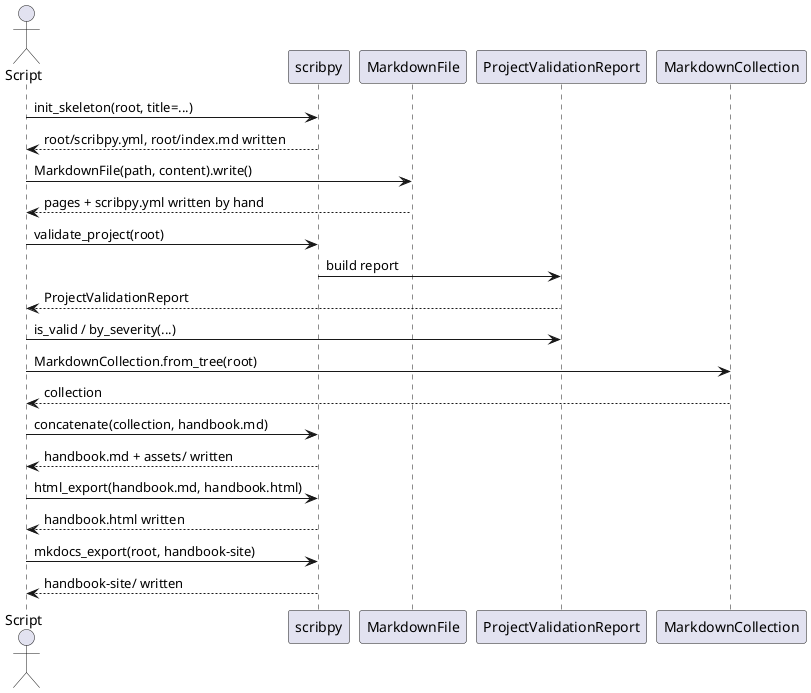

# Complete Python API tutorial

This executable example builds the same handbook as the CLI tutorial. It shows
where filesystem work remains the caller's responsibility and where Scribpy
takes over, and walks through every stage of the [end-user API](end-user.md)
in the order a real application would call it: scaffold, write content,
validate, inspect findings programmatically, assemble, export twice, and add
logging.

The complete runnable file is available as
[`examples/python-handbook.py`](../examples/python-handbook.py). The sections
below explain it step by step, then a full self-contained script closes the
page. Run the complete example once from an empty directory:

```shell
python /path/to/scribpy/docs/examples/python-handbook.py
```

## Overview



## 1. Initialize the project

```python
from pathlib import Path

import scribpy

root = Path("handbook-api")
build = Path("build-api")

scribpy.init_skeleton(
    root,
    title="Team Handbook",
    author="Documentation Team",
    version="1.0.0",
)
```

`init_skeleton` creates `root`, `scribpy.yml`, and `index.md`. `title` is
mandatory and keyword-only; `author` and `version` are optional. It raises
`ScaffoldCollisionError` rather than replacing an existing root manifest —
wrap the call if the script might run twice against the same directory:

```python
try:
    scribpy.init_skeleton(root, title="Team Handbook")
except scribpy.ScaffoldCollisionError as error:
    print(f"Skipping scaffold: project already exists at {error.path}")
```

### Alternative: scaffold from an outline

Instead of a bare skeleton, you can derive the whole page tree from a
headings-only Markdown outline. This is useful when a table of contents
already exists (for example, sketched by a technical writer) and you want
Scribpy to create the matching folders and stub pages:

```python
outline = Path("outline.md")
outline.write_text(
    "# Team Handbook\n"
    "## Guide\n"
    "### Installation\n"
    "### Configuration\n"
    "## Reference\n",
    encoding="utf-8",
)

nodes = scribpy.parse_outline(outline, max_depth=4)
print(nodes[0].title, [child.title for child in nodes[0].children])
# Team Handbook ['Guide', 'Reference']

scribpy.init_from_outline(outline, root, max_depth=4)
```

Leaf headings become stub Markdown pages; headings with children become
directories with their own local `scribpy.yml`. `parse_outline` raises
`OutlineValidationError` (carrying a one-based `line_number`) for a
malformed outline, such as a heading level that skips a level. The rest of
this tutorial continues with `init_skeleton`, since it gives full control
over page content.

## 2. Write pages, manifests, and an image

Scribpy models can write Markdown, while ordinary `pathlib` handles YAML and
binary assets:

```python
guide = root / "guide"
assets = root / "assets"
guide.mkdir()
assets.mkdir()

home = scribpy.MarkdownFile(
    path=root / "index.md",
    content=(
        "# Welcome\n\n"
        "\n\n"
        "Read the [installation guide](guide/installation.md).\n"
    ),
)
home.write()

installation = scribpy.MarkdownFile(
    path=guide / "installation.md",
    content=(
        "# Installation\n\n"
        "Install the package in an isolated environment.\n\n"
        "Steps:\n\n"
        "- Create the environment.\n"
        "- Install the package.\n"
    ),
)
installation.write()

# A tiny valid PNG used only to keep this example self-contained.
png = bytes.fromhex(
    "89504e470d0a1a0a0000000d494844520000000100000001"
    "08060000001f15c4890000000d4944415408d763f8cfc0f01f"
    "00050001ff89993d1d0000000049454e44ae426082"
)
(assets / "logo.png").write_bytes(png)

(root / "scribpy.yml").write_text(
    """project:
  title: Team Handbook
  author: Documentation Team
  version: 1.0.0
build:
  toc: true
  toc_depth: 3
  heading_numbering:
    enabled: true
order:
  - index.md
  - guide/
  - assets/
""",
    encoding="utf-8",
)

(guide / "scribpy.yml").write_text(
    """title: User guide
order:
  - installation.md
""",
    encoding="utf-8",
)
```

Image targets are still relative to the Markdown file containing them. The API
does not change this rule.

`MarkdownFile(path, content, encoding="utf-8")` is a frozen dataclass: it does
not touch disk until `.write()` is called, and `.write(path=None)` creates
parent directories as needed, returning the path written. Read a page back
with `MarkdownFile.from_path(path, *, encoding="utf-8")`.

### Inspecting a page before writing it

Because `MarkdownFile` is a plain value, you can inspect and transform it
before committing anything to disk — useful for templated content:

```python
draft = scribpy.MarkdownFile(
    path=guide / "configuration.md",
    content="# Configuration\n\nTODO: describe environment variables.\n",
)
published = draft.replace_text("TODO: describe", "Describes")
print(published.content)
published.write()

document = published.to_document()
print([ref.target for ref in document.image_references])  # []
```

`replace_text` and `with_content` return a new `MarkdownFile` rather than
mutating the original. `to_document()` produces a path-free `MarkdownDocument`
and eagerly extracts its `image_references` (as `MarkdownImageReference`
values with `alt_text`, `target`, optional `title`, and optional one-based
`line`/`column`).

## 3. Validate and inspect findings

```python
report = scribpy.validate_project(root)

print(f"Markdown files: {report.markdown_count}")
print(f"Manifests: {report.manifest_count}")

if not report.is_valid:
    scribpy.render_validation_report(report)
    raise SystemExit(1)

warnings = report.by_severity(scribpy.DiagnosticSeverity.WARNING)
for warning in warnings:
    print(warning.code, warning.path, warning.message)
```

`validate_project` turns expected manifest, decoding, filesystem, MkForge, and
collection problems into structured diagnostics. It does not hide unexpected
programming failures.

### Reading a report programmatically

`ProjectValidationReport` is a plain dataclass, so an application can act on
it without printing anything — for example, gate a CI job, aggregate findings
across multiple projects, or convert diagnostics to another format:

```python
report = scribpy.validate_project(root)

errors = report.by_severity(scribpy.DiagnosticSeverity.ERROR)
warnings = report.by_severity(scribpy.DiagnosticSeverity.WARNING)

summary = {
    "root": str(report.root),
    "is_valid": report.is_valid,
    "markdown_count": report.markdown_count,
    "manifest_count": report.manifest_count,
    "error_count": len(errors),
    "warning_count": len(warnings),
}
print(summary)

for finding in report.diagnostics:
    location = f"{finding.path}:{finding.line}" if finding.path else "(project)"
    print(f"[{finding.severity.value}] {finding.code} {location} — {finding.message}")
```

Each `ProjectDiagnostic` carries `code`, `severity`, `message`, and optional
`path`, `line`, `column`, `category`, and `target`. Project-wide problems
(for example, an unreadable root directory) have no `path`; source-level
problems (for example, a missing image) do.

### Troubleshooting: turning a failed report into an exception

A common pattern at an application boundary is to fail fast with a precise
error instead of continuing past a broken project:

```python
report = scribpy.validate_project(root)
if not report.is_valid:
    first_error = report.by_severity(scribpy.DiagnosticSeverity.ERROR)[0]
    raise scribpy.InvalidMarkdownError(
        f"{first_error.code} at {first_error.path}: {first_error.message}"
    )
```

This is deliberately manual: `validate_project` never raises for expected
project-input problems, so your code decides whether "invalid" means "stop
the script," "log and continue," or "return an HTTP 422." `by_severity`
preserves finding order, so `[0]` is the first error encountered during
validation, not necessarily the most important one — inspect `category` and
`code` when a script needs to distinguish, say, manifest problems from
Markdown structure problems.

### Collection rules alone

`validate_project` layers project-wide checks (manifests, encoding, MkForge)
on top of collection rules. If you already have a `MarkdownCollection` and
only want the collection-level checks (heading structure, links, images),
call `diagnose()` directly instead of revalidating the whole project:

```python
collection = scribpy.MarkdownCollection.from_tree(root)
collection_report = collection.diagnose()
if collection_report.has_errors:
    raise scribpy.InvalidMarkdownError(collection_report.summary())
```

## 4. Assemble Markdown

```python
build.mkdir(exist_ok=True)
markdown_output = build / "handbook.md"

collection = scribpy.MarkdownCollection.from_tree(root)
scribpy.concatenate(collection, markdown_output)

print(markdown_output.read_text(encoding="utf-8")[:200])
```

`MarkdownCollection.from_tree` resolves traversal and manifest settings.
`concatenate` applies the build pipeline and writes collected images beside the
output under `build-api/assets/`.

### Inspecting the collection before assembling

`MarkdownCollection` exposes its resolved manifest and file order, which is
useful to sanity-check before committing to a build:

```python
collection = scribpy.MarkdownCollection.from_tree(root)

print(collection.manifest.project.get("title"))
print(collection.manifest.build.toc, collection.manifest.build.toc_depth)
for markdown_file in collection.files:
    print(markdown_file.path.relative_to(root))
```

`collection.concatenate()` (the method, distinct from the top-level
`scribpy.concatenate()` function) performs only the in-memory structural
merge — one H1, folder headings, shifted source headings — and returns a
`MarkdownDocument` without touching disk or running the diagram/link/TOC
pipeline. The public `scribpy.concatenate(collection, output)` function
wraps this and additionally applies link rewriting, heading numbering, TOC
generation, diagram rendering, and image collection, then writes the result.
Prefer the module-level function unless you are specifically testing the
structural merge in isolation.

## 5. Export HTML

```python
css = build / "handbook.css"
css.write_text("h1, h2 { color: #263c78; }\n", encoding="utf-8")

scribpy.html_export(
    markdown_output,
    build / "handbook.html",
    toc_depth=3,
    css=css,
)
```

The output parent must already exist. The HTML contains CSS and JavaScript but
still references copied image files, so retain `build-api/assets/`.
`html_export` raises `FileNotFoundError` if `markdown_output` or `css` does
not exist, and `UnicodeDecodeError` if either is not valid UTF-8.

## 6. Export MkDocs input

```python
scribpy.mkdocs_export(root, build / "handbook-site")
```

This reads the source project again—it does not consume `handbook.md`. It keeps
the page tree and file links while rendering diagrams and collecting images.
`ScaffoldCollisionError` protects an existing destination `mkdocs.yml`.

## 7. Add logging around the build

`logging_context` is useful to trace exactly what Scribpy did during a build
without permanently configuring application-wide logging:

```python
log_path = build / "scribpy.log"

with scribpy.logging_context(level="DEBUG", file=log_path, console=False):
    collection = scribpy.MarkdownCollection.from_tree(root)
    scribpy.concatenate(collection, markdown_output)

print(log_path.read_text(encoding="utf-8")[-500:])
```

`console=False` keeps the script's own stdout clean while every DEBUG-level
message still lands in `scribpy.log`. All handlers added by the context are
removed on exit, so calling `logging_context` again later (for example, to
capture only the MkDocs export) starts from a clean slate:

```python
with scribpy.logging_context(level="INFO", file=build / "export.log"):
    scribpy.mkdocs_export(root, build / "handbook-site")
```

## 8. Handle expected failures

At an application boundary, catch only failures you can explain or recover
from:

```python
try:
    collection = scribpy.MarkdownCollection.from_tree(root)
    scribpy.concatenate(collection, markdown_output)
except scribpy.InvalidScribpyManifestError as error:
    print(f"Invalid manifest {error.path}: {error.detail}")
except scribpy.InvalidMarkdownError as error:
    print(error.detail)
except (scribpy.PlantUmlRenderError, scribpy.MermaidRenderError) as error:
    print(f"Diagram rendering failed: {error}")
except OSError as error:
    print(f"Filesystem operation failed: {error}")
```

Avoid catching `Exception`: unexpected defects should remain visible.

## Full script

The following mirrors [`examples/python-handbook.py`](../examples/python-handbook.py)
and can be copied into a `.py` file and run directly. It combines every stage
above — scaffold, write content, validate with a fail-fast check, assemble,
export HTML, export MkDocs, and a final logging pass — into one script:

```python
"""Build the documentation tutorial project through Scribpy's Python API."""

from pathlib import Path

import scribpy


def main() -> None:
    """Create, validate, assemble, and export the tutorial handbook."""
    root = Path("handbook-api")
    build = Path("build-api")

    scribpy.init_skeleton(
        root,
        title="Team Handbook",
        author="Documentation Team",
        version="1.0.0",
    )

    guide = root / "guide"
    assets = root / "assets"
    guide.mkdir()
    assets.mkdir()

    scribpy.MarkdownFile(
        path=root / "index.md",
        content=(
            "# Welcome\n\n"
            "\n\n"
            "Read the [installation guide](guide/installation.md).\n"
        ),
    ).write()
    scribpy.MarkdownFile(
        path=guide / "installation.md",
        content=(
            "# Installation\n\n"
            "Install the package in an isolated environment.\n\n"
            "Steps:\n\n"
            "- Create the environment.\n"
            "- Install the package.\n"
        ),
    ).write()

    png = bytes.fromhex(
        "89504e470d0a1a0a0000000d494844520000000100000001"
        "08060000001f15c4890000000d4944415408d763f8cfc0f01f"
        "00050001ff89993d1d0000000049454e44ae426082"
    )
    (assets / "logo.png").write_bytes(png)
    (root / "scribpy.yml").write_text(
        """project:
  title: Team Handbook
  author: Documentation Team
  version: 1.0.0
build:
  toc: true
  toc_depth: 3
  heading_numbering:
    enabled: true
order:
  - index.md
  - guide/
  - assets/
""",
        encoding="utf-8",
    )
    (guide / "scribpy.yml").write_text(
        """title: User guide
order:
  - installation.md
""",
        encoding="utf-8",
    )

    report = scribpy.validate_project(root)
    if not report.is_valid:
        scribpy.render_validation_report(report)
        raise SystemExit(1)

    build.mkdir(exist_ok=True)
    markdown_output = build / "handbook.md"

    with scribpy.logging_context(level="INFO", file=build / "scribpy.log"):
        collection = scribpy.MarkdownCollection.from_tree(root)
        scribpy.concatenate(collection, markdown_output)

    scribpy.html_export(markdown_output, build / "handbook.html")
    scribpy.mkdocs_export(root, build / "handbook-site")
    print("Created build-api/handbook.md, handbook.html, and handbook-site/")


if __name__ == "__main__":
    main()
```

See the [end-user API](end-user.md) for the full function-by-function
reference and the [Python API reference](../reference/python-api.md) for
every exported name.
