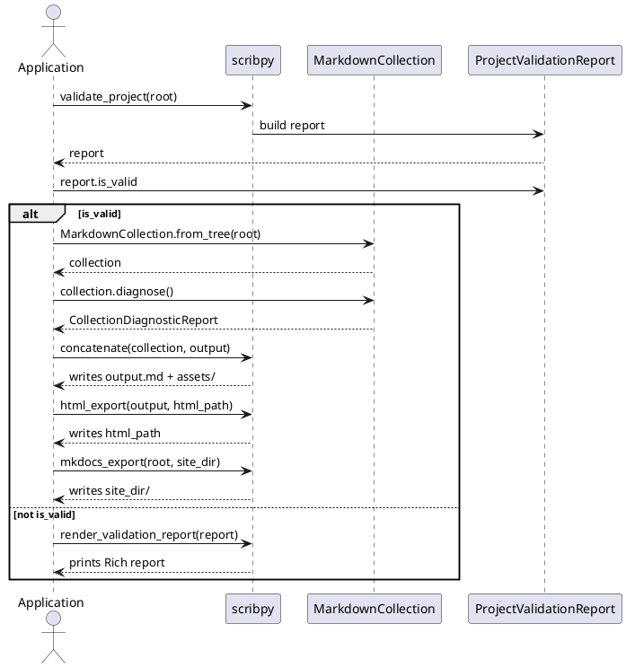

# End-user API

The package root is the supported end-user boundary. Start with `import
scribpy`, then combine focused functions rather than importing internal
pipeline steps.

!!! note
    Every name documented on this page is listed in `scribpy.__all__`. If a
    name is not importable as `scribpy.<Name>`, it belongs to the
    [Extension API](extensions.md) instead.

## Object-level workflow

The functions below operate on a small set of domain objects. This sequence
diagram shows how they interact for the common validate-then-build path:



Two things to note: `concatenate` consumes an in-memory `MarkdownCollection`
and writes the assembled Markdown, while `html_export` and `mkdocs_export`
read from disk again — `html_export` from the assembled Markdown file,
`mkdocs_export` from the original source project. See
[Export](#export) below.

## Create a project

```python
from pathlib import Path

import scribpy

scribpy.init_skeleton(
    Path("handbook"),
    title="Team Handbook",
    author="Ada",
    version="1.0.0",
)
```

To create a hierarchy from headings:

```python
outline = Path("outline.md")
nodes = scribpy.parse_outline(outline, max_depth=4)
print(nodes[0].title, nodes[0].children)

scribpy.init_from_outline(
    outline,
    Path("handbook"),
    max_depth=4,
)
```

Both initialization workflows protect an existing `scribpy.yml` with
`ScaffoldCollisionError`.

```python
try:
    scribpy.init_skeleton(Path("handbook"), title="Team Handbook")
except scribpy.ScaffoldCollisionError as error:
    print(f"A project already exists at: {error.path}")
```

An invalid outline (for example, a heading level jump that skips levels, or
`max_depth` outside 1-6) raises `OutlineValidationError`, which carries a
one-based `line_number`:

```python
try:
    nodes = scribpy.parse_outline(outline, max_depth=4)
except scribpy.OutlineValidationError as error:
    print(f"Outline problem at line {error.line_number}: {error.detail}")
```

## Work with one Markdown value

```python
page = scribpy.MarkdownFile.from_path("handbook/index.md")
print(page.name, page.suffix, page.encoding)

updated = page.replace_text("Draft", "Published")
updated.write("work/index.md")

document = updated.to_document()
for image in document.image_references:
    print(image.target, image.line, image.column)
```

`MarkdownFile` keeps path, content, and encoding. `MarkdownDocument` is
path-free in-memory content. Both are immutable-style values: `with_content`
and `replace_text` return new objects. `MarkdownImageReference` records the
alt text, raw target, optional title, and optional one-based line/column of
one image found inside a `MarkdownDocument`.

```python
document = scribpy.MarkdownDocument(
    '# Page\n\n\n'
)
reference = document.image_references[0]
assert reference.target == "assets/logo.png"
assert reference.title == "Brand"
```

## Validate with or without presentation

```python
report = scribpy.validate_project("handbook")
if not report.is_valid:
    scribpy.render_validation_report(report)
```

For a small script where printing is desired immediately:

```python
if not scribpy.valid_report("handbook"):
    raise SystemExit(1)
```

Pass a custom Rich `Console` to `valid_report` or
`render_validation_report` when capturing output in a host application.

`validate_project(root)` returns a `ProjectValidationReport` — inspect
`is_valid`, `has_errors`, `markdown_count`, `manifest_count`, and iterate
`diagnostics` (a tuple of `ProjectDiagnostic`). Filter by severity with
`by_severity`:

```python
report = scribpy.validate_project("handbook")

warnings = report.by_severity(scribpy.DiagnosticSeverity.WARNING)
for warning in warnings:
    print(warning.code, warning.path, warning.message)

print(f"{report.markdown_count} Markdown files, "
      f"{report.manifest_count} manifests inspected")
```

| Function | Purpose |
|---|---|
| `validate_project(root)` | Returns a structured `ProjectValidationReport`. Does not print. Use in services, tests, CI gates. |
| `valid_report(root, *, console=None)` | Calls `validate_project`, renders with Rich, returns `bool`. Convenience wrapper, not a distinct validator. |
| `render_validation_report(report, *, console=None)` | Presents an existing report. Does not revalidate the filesystem. |

## Load, diagnose, and assemble

```python
root = Path("handbook")
collection = scribpy.MarkdownCollection.from_tree(root, encoding="utf-8")

diagnostics = collection.diagnose()
if diagnostics.has_errors:
    raise scribpy.InvalidMarkdownError(diagnostics.summary())

output = Path("build/handbook.md")
scribpy.concatenate(collection, output)
```

The manifest belongs to the collection and controls transforms:

```python
print(collection.manifest.project)
print(collection.manifest.build.toc)
print([item.path for item in collection.files])
```

`collection.manifest` is a `RootManifest` (`path`, `project`, `build`,
`order`). Folders below the root use the smaller `FolderManifest` (`path`,
`title`, `order`), loaded automatically while traversing — you normally do
not construct either by hand.

`collection.diagnose(rules=None)` runs the eight default collection rules
when `rules` is omitted, or exactly the rules you pass:

```python
errors_only = [
    rule
    for rule in (
        scribpy.SourceFirstHeadingH1Rule(),
        scribpy.SourceH1CountRule(),
        scribpy.HeadingLevelOverflowRule(),
        scribpy.InternalMarkdownLinkRule(),
        scribpy.LocalImageMissingRule(),
        scribpy.ExternalImageReferenceRule(),
    )
]
report = collection.diagnose(errors_only)
```

These six rule classes are exported from `scribpy.__all__` because they are
useful to reference directly (for example, to build a custom subset). Two
more default rules — `LocalAnchorLinkRule` and `ImageOutsideRootRule` — exist
but are only reachable from `scribpy.core.diagnostics`; see the
[Extension API](extensions.md).

`CollectionDiagnosticReport` (returned by `diagnose()`) exposes `has_errors`,
`by_severity(severity)`, and `summary()`. `CollectionDiagnostic` is the
individual finding (`code`, `severity`, `message`, `path`, `line`).
`CollectionDiagnosticRule` is the structural protocol every rule satisfies —
see the [Extension API](extensions.md) for writing your own.

## Export

```python
scribpy.html_export(
    Path("build/handbook.md"),
    Path("build/handbook.html"),
    toc_depth=3,
    css=Path("handbook.css"),
)

scribpy.mkdocs_export(
    Path("handbook"),
    Path("build/handbook-site"),
)
```

HTML consumes assembled Markdown. MkDocs export consumes the original project.
This distinction matches the CLI and prevents accidental double assembly.

`html_export(source, output, toc_depth=3, css=None)` reads UTF-8 Markdown at
`source`, strips Scribpy's own TOC block, derives navigation from headings,
and writes a self-contained HTML file with inlined CSS and menu JavaScript.
It does not create the output's parent directory, and raises
`FileNotFoundError` if `source` or `css` is missing.

`mkdocs_export(source, output)` loads the project at `source` again (not the
assembled Markdown), renders diagrams, collects images, derives navigation,
and writes a minimal `mkdocs.yml` under `output`. It raises
`ScaffoldCollisionError` if `output/mkdocs.yml` already exists.

## Add temporary logging

```python
with scribpy.logging_context(
    level="DEBUG",
    file=Path("build/scribpy.log"),
    console=True,
):
    collection = scribpy.MarkdownCollection.from_tree("handbook")
    scribpy.concatenate(collection, Path("build/handbook.md"))
```

The context removes its handlers and restores the previous logger level on
exit. `level` accepts a standard name (`"DEBUG"`, `"INFO"`, ...) or a numeric
logging level. Set `console=False` to suppress stderr output while still
writing to `file`.

## Handling exceptions

`concatenate`, `html_export`, and `mkdocs_export` do not convert failures
into reports — they raise. Catch only what your application can explain or
recover from:

```python
try:
    collection = scribpy.MarkdownCollection.from_tree(root)
    scribpy.concatenate(collection, output)
except scribpy.InvalidScribpyManifestError as error:
    print(f"Invalid manifest {error.path}: {error.detail}")
except scribpy.InvalidMarkdownError as error:
    print(f"Invalid Markdown: {error.detail}")
except (scribpy.PlantUmlRenderError, scribpy.MermaidRenderError) as error:
    print(f"Diagram rendering failed: {error}")
except scribpy.ScaffoldCollisionError as error:
    print(f"Target already has a project: {error.path}")
except OSError as error:
    print(f"Filesystem operation failed: {error}")
```

`PlantUmlRenderError` and `MermaidRenderError` are both exported from
`scribpy.__all__` — every diagram-rendering failure raised anywhere in the
pipeline (server backend, Kroki backend, or Mermaid CLI) surfaces as one of
these two domain exceptions, never a raw `requests`/`subprocess` error.

All exceptions except `ScribpyManifestWarning` inherit from `ScribpyError`,
so a broad boundary can also do:

```python
try:
    scribpy.concatenate(collection, output)
except scribpy.ScribpyError as error:
    print(f"Scribpy could not complete the build: {error}")
```

Avoid catching bare `Exception`: unexpected defects should remain visible.

| Exception | Raised for | Key attributes |
|---|---|---|
| `ScribpyError` | Base class for all domain failures. | — |
| `InvalidMarkdownError` | Blocking Markdown/collection structure problem. | `detail` |
| `InvalidScribpyManifestError` | Invalid `scribpy.yml`. | `path`, `detail` |
| `PlantUmlRenderError` | PlantUML backend failed to render. | `detail` |
| `MermaidRenderError` | Mermaid backend failed to render. | `detail` |
| `OutlineValidationError` | Outline Markdown is structurally invalid. | `line_number`, `detail` |
| `ScaffoldCollisionError` | Target already has a `scribpy.yml`. | `path` |
| `ScribpyManifestWarning` | Ignored manifest key (a `UserWarning`, not raised). | — |

See the [Python API reference](../reference/python-api.md) for every root
export and the [complete tutorial](demo.md) for a runnable workflow.
