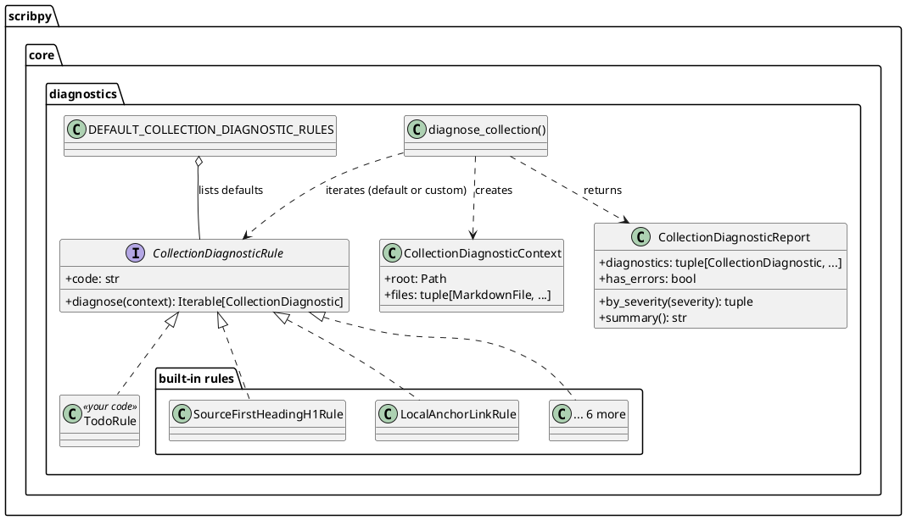
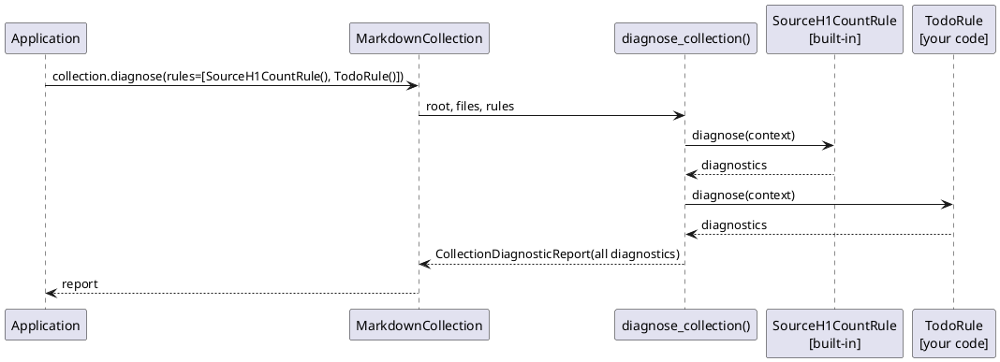

# Extension API

Extension interfaces are deliberately not available from `scribpy.__all__`.
Import them from their core packages: `scribpy.core.diagnostics`,
`scribpy.core.plantuml`, and `scribpy.core.mermaid`.

This is where you reach when the [end-user API](end-user.md) does not cover
what you need: a project-specific diagnostic check, or a diagram renderer
backed by infrastructure Scribpy does not know about.

## Design pattern: Strategy + Registry

Both extension points in this file follow the same shape, deliberately:

- **Strategy** — diagnostic rules and renderers are each defined by a small
  `Protocol` (one method). Any object satisfying the protocol is
  interchangeable with the built-in implementations; nothing in the engine
  or the factories needs to know your class exists ahead of time.
- **Registry** — `DEFAULT_COLLECTION_DIAGNOSTIC_RULES` is a plain tuple of
  rule instances that `diagnose_collection` iterates. `make_renderer()` is a
  plain `dict[str, factory]` that `PlantUmlRenderer`/`MermaidRenderer`
  factories look up by backend name.

The practical difference between the two registries matters: **diagnostic
rules are open** — you can build any iterable of rules yourself and hand it
to `collection.diagnose(rules=...)` or `diagnose_collection(...)`, bypassing
the default registry entirely. **Renderer backends are closed** —
`make_renderer()` in `scribpy.core.plantuml.renderer` and
`scribpy.core.mermaid.renderer` each hold a private
`dict[str, RendererFactory]` keyed by backend name (`"plantuml_server"`,
`"kroki"`, `"web"`, `"local"` for PlantUML; `"kroki"`, `"web"`,
`"mermaid_cli"`, `"local"` for Mermaid) with no registration function
exposed. Adding a new *named* backend means adding an entry to Scribpy's
internal registry and tests — an application cannot make
`make_renderer("my_backend")` work. What an application *can* do is
construct its own `PlantUmlRenderer`/`MermaidRenderer`-shaped object
directly and pass it wherever the pipeline accepts a renderer instance,
skipping the factory entirely.

## Diagnostic rules

### The engine, in outline



`TodoRule` — a rule you write — implements exactly the same `Protocol` as the
eight built-in rules. The engine has no special case for "built-in" versus
"custom"; it only ever calls `.diagnose(context)` on whatever iterable of
rules it is given.

### Sequence: running a mixed rule set



### The protocol

```python
from collections.abc import Iterable
from typing import Protocol

class CollectionDiagnosticRule(Protocol):
    """Protocol implemented by collection diagnostic strategies."""

    code: str

    def diagnose(
        self,
        context: "CollectionDiagnosticContext",
    ) -> Iterable["CollectionDiagnostic"]:
        ...
```

`CollectionDiagnosticContext` carries `root: Path` and
`files: tuple[MarkdownFile, ...]` — everything a rule needs is already
loaded; rules never touch the filesystem themselves.

### Complete worked example: flagging TODO markers

```python
from collections.abc import Iterable

from scribpy.core.diagnostics import (
    CollectionDiagnostic,
    CollectionDiagnosticContext,
    CollectionDiagnosticRule,
    DiagnosticSeverity,
)


class TodoRule:
    """Flag any source file that still contains a TODO marker."""

    code = "TODO_FOUND"

    def diagnose(
        self, context: CollectionDiagnosticContext
    ) -> Iterable[CollectionDiagnostic]:
        """Return one warning per Markdown file containing "TODO".

        Args:
            context: Collection diagnostic context.

        Returns:
            Warning diagnostics for every file with a TODO marker.
        """
        return tuple(
            CollectionDiagnostic(
                code=self.code,
                severity=DiagnosticSeverity.WARNING,
                message="Remove TODO before publication.",
                path=item.path,
            )
            for item in context.files
            if "TODO" in item.content
        )
```

Use it standalone, or alongside the defaults:

```python
import scribpy
from scribpy.core.diagnostics import DEFAULT_COLLECTION_DIAGNOSTIC_RULES

collection = scribpy.MarkdownCollection.from_tree("handbook")

# Only your rule:
rule: scribpy.CollectionDiagnosticRule = TodoRule()
report = collection.diagnose(rules=[rule])

# Defaults plus your rule:
report = collection.diagnose(rules=[*DEFAULT_COLLECTION_DIAGNOSTIC_RULES, TodoRule()])

if report.has_errors:
    raise scribpy.InvalidMarkdownError(report.summary())
```

Or call the engine directly, without going through a `MarkdownCollection`:

```python
from pathlib import Path

from scribpy.core.diagnostics import diagnose_collection

report = diagnose_collection(Path("handbook"), collection.files, [TodoRule()])
```

`CollectionDiagnosticRule` itself (the Protocol type) and `TodoRule`
instances built against it are structurally compatible with
`scribpy.CollectionDiagnosticRule` — the type re-exported at the package
root is the same Protocol, so annotations written against either name are
interchangeable.

!!! note
    Two more built-in rules — `LocalAnchorLinkRule` and
    `ImageOutsideRootRule` — exist in `scribpy.core.diagnostics` but are not
    part of `scribpy.__all__`. They behave exactly like the six rules
    documented on the [end-user API](end-user.md#load-diagnose-and-assemble)
    page; import them the same way as `TodoRule` above:
    `from scribpy.core.diagnostics import LocalAnchorLinkRule`.

## Renderer protocols and factories

### Architecture

PlantUML and Mermaid renderers share the same three-layer shape: protocol,
factory, backends.

```plantuml
@startuml
skinparam classAttributeIconSize 0

package "scribpy.core.plantuml" {
  interface PlantUmlRenderer {
    +render(diagram: str): bytes
  }
  class "make_renderer(backend)" as puml_factory
  class KrokiRenderer as puml_kroki
  class PlantUmlServerRenderer as puml_server
  class LocalRenderer as puml_local
  class YourRenderer <<your code>>
}

PlantUmlRenderer <|.. puml_kroki
PlantUmlRenderer <|.. puml_server
PlantUmlRenderer <|.. puml_local
PlantUmlRenderer <|.. YourRenderer
puml_factory ..> puml_kroki : "kroki" / "web"
puml_factory ..> puml_server : "plantuml_server"
puml_factory ..> puml_local : "local"
note right of YourRenderer
  Not reachable through
  make_renderer() by name.
  Construct directly and
  pass the instance in.
end note
@enduml
```

`MermaidRenderer` in `scribpy.core.mermaid` mirrors this exactly, with
`KrokiRenderer` and `MermaidCliRenderer` as its built-in implementations.

### The protocols

```python
from typing import Protocol

class PlantUmlRenderer(Protocol):
    """Render a PlantUML diagram source to PNG bytes.

    Implementations must be stateless and thread-safe.
    """

    def render(self, diagram: str) -> bytes:
        """Render a PlantUML diagram to PNG bytes.

        Raises:
            PlantUmlRenderError: If the rendering backend fails.
        """
        ...
```

`MermaidRenderer` has the identical shape (`render(diagram: str) -> bytes`,
raising `MermaidRenderError` instead). Both are single-method Protocols —
any object with a matching `render` method satisfies them, with no
inheritance required.

### Using the built-in factories

```python
from scribpy.core.plantuml import PlantUmlRenderer
from scribpy.core.plantuml import make_renderer as make_plantuml_renderer
from scribpy.core.mermaid import MermaidRenderer
from scribpy.core.mermaid import make_renderer as make_mermaid_renderer

plantuml: PlantUmlRenderer = make_plantuml_renderer("kroki")
mermaid: MermaidRenderer = make_mermaid_renderer("mermaid_cli", command="mmdc")
png = plantuml.render("@startuml\nAlice -> Bob\n@enduml")
```

`make_renderer(backend, *, server_url=...)` for PlantUML and
`make_renderer(backend, *, command=...)` for Mermaid both raise `ValueError`
for an unrecognized `backend` name — this is the closed registry described
above.

### Complete worked example: a custom renderer

Because `make_renderer()` cannot be extended by name, a fully custom
renderer is a plain class satisfying the protocol, constructed directly:

```python
import subprocess  # nosec B404

from scribpy.errors import PlantUmlRenderError


class LocalJarPlantUmlRenderer:
    """Render PlantUML by shelling out to a locally installed plantuml.jar.

    Attributes:
        jar_path: Path to the plantuml.jar file used for rendering.
    """

    def __init__(self, jar_path: str) -> None:
        """Initialize with the path to a local plantuml.jar.

        Args:
            jar_path: Path to plantuml.jar on the local filesystem.
        """
        self.jar_path = jar_path

    def render(self, diagram: str) -> bytes:
        """Render a PlantUML diagram by invoking plantuml.jar.

        Args:
            diagram: PlantUML diagram source, without fence delimiters.

        Returns:
            PNG image bytes produced by plantuml.jar.

        Raises:
            PlantUmlRenderError: If the subprocess exits with an error.
        """
        try:
            result = subprocess.run(  # nosec B603
                ["java", "-jar", self.jar_path, "-pipe", "-tpng"],
                input=diagram.encode("utf-8"),
                capture_output=True,
                check=True,
            )
        except (OSError, subprocess.CalledProcessError) as error:
            raise PlantUmlRenderError(str(error)) from error
        return result.stdout
```

This renderer is not registered anywhere — it is simply constructed and
passed wherever the pipeline accepts a `PlantUmlRenderer`-shaped object.
Scribpy's manifest-driven `build.plantuml_backend` selection (used by
`concatenate()` and `mkdocs_export()` internally) only knows the closed set
of names above; a fully custom renderer is for code that builds its own
diagram-rendering call sites rather than going through the manifest, or for
tests:

```python
renderer = LocalJarPlantUmlRenderer(jar_path="/opt/plantuml/plantuml.jar")
png_bytes = renderer.render("@startuml\nAlice -> Bob\n@enduml")
```

### A trivial test double

For unit tests exercising code that accepts a renderer, a minimal stub is
often enough — it only needs the one method:

```python
class StubPlantUmlRenderer:
    """Return fixed bytes without performing any real rendering."""

    def render(self, diagram: str) -> bytes:
        """Return a constant PNG-shaped payload for any diagram source.

        Args:
            diagram: Ignored diagram source.

        Returns:
            A fixed placeholder byte string.
        """
        return b"fake-png-bytes"
```

### Decorating an existing renderer

Because both protocols are single-method, wrapping a built-in renderer
(caching, retries, metrics) is ordinary composition — no base class to
extend:

```python
class CachedPlantUmlRenderer:
    """Cache PlantUML renders in memory by diagram source."""

    def __init__(self, delegate: PlantUmlRenderer) -> None:
        """Initialize with the renderer to cache results for.

        Args:
            delegate: Underlying renderer performing real rendering.
        """
        self._delegate = delegate
        self._cache: dict[str, bytes] = {}

    def render(self, diagram: str) -> bytes:
        """Render a diagram, reusing a previous result when available.

        Args:
            diagram: PlantUML diagram source.

        Returns:
            PNG image bytes, from cache when the source repeats.
        """
        if diagram not in self._cache:
            self._cache[diagram] = self._delegate.render(diagram)
        return self._cache[diagram]
```

!!! note
    Everything on this page is imported from `scribpy.core.*`, not from the
    `scribpy` top-level package. If you find yourself typing
    `scribpy.core.diagnostics` or `scribpy.core.plantuml` in application
    code, that is expected — it is the signal that you have crossed from the
    [end-user API](end-user.md) into the extension surface.
