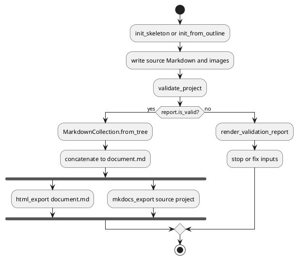
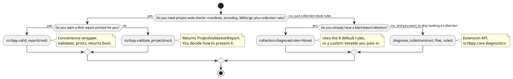

# Python API workflow

The Python API exposes the same stages as the CLI, but your application decides
how to display reports, recover from errors, name outputs, and integrate the
result into a larger workflow.

This section is split into two parts:

- **[End-user API](end-user.md)** — the workflow surface you should reach for
  first. Everything on that page is importable directly from `scribpy`
  (`scribpy.__all__`): validation, initialization, assembly, and export
  functions plus the domain models they use.
- **[Extension API](extensions.md)** — for building custom diagnostic rules or
  custom diagram renderers. Nothing on that page is exported from the
  `scribpy` package root; it lives one level deeper, in `scribpy.core.*`
  submodules, and is imported explicitly by name.

The boundary is deliberate: `scribpy.__all__` is the supported surface for
ordinary projects, while `scribpy.core.*` submodules are the seams where the
engine can be extended without editing it.

Import normal application interfaces from `scribpy`:

```python
from pathlib import Path

import scribpy
```

Do not import internal assembly modules for ordinary use. Extension protocols
and factories are the exception and are documented separately in the
[Extension API](extensions.md).

## Typical workflow



Two validation styles are available:

```python
# Structured result: best for applications and tests.
report = scribpy.validate_project(root)

# Validate + print a Rich report + return bool: convenient for scripts.
is_valid = scribpy.valid_report(root)
```

## Choosing a validation entry point

Scribpy exposes validation at three levels: a whole-project convenience
function, a collection-level method, and the underlying diagnostic engine.
Each one wraps the next, adding presentation or scope but no independent
logic. Use the flowchart below to pick the right one:



In practice: use `validate_project` or `valid_report` for anything that
resembles "check this whole project before I do something with it" (CI,
pre-build gates, a CLI subcommand). Use `MarkdownCollection.diagnose()` when
you already loaded a collection for assembly and want its diagnostics without
paying for a second project-wide pass. Reach for `diagnose_collection`
directly only when you are writing extension code that operates on files
without a full collection object — see the [Extension API](extensions.md).

Continue with the [end-user API](end-user.md) or jump straight to the
[complete Python tutorial](demo.md).
